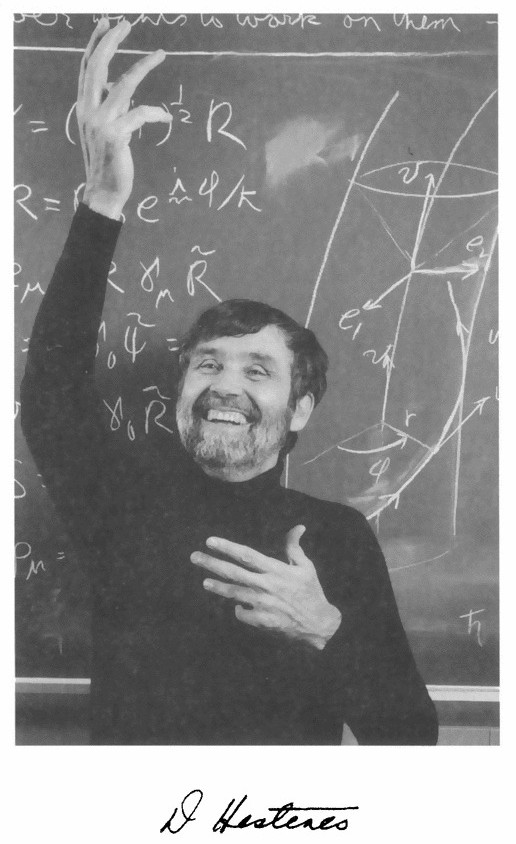

|:-:|
||
|*William Kindom Clifford*|

This document describes the implementation, installation and use of a geometric algebra module written in python that utilizes the *sympy* symbolic algebra library. The python module ga has been developed for coordinate free calculations using the operations (geometric, outer, and inner products etc.) of geometric algebra. The operations can be defined using a completely arbitrary metric defined by the inner products of a set of arbitrary vectors or the metric can be restricted to enforce orthogonality and signature constraints on the set of vectors. Additionally, a metric that is a function of a coordinate set can be defined so that a geometric algebra over a manifold can be implemented. Geometric algebras over submanifolds of the base manifold are also supported as well as linear multivector differential operators and linear transformations. In addition the module includes the geometric, outer (curl) and inner (div) derivatives. The module requires the *sympy* module and the numpy module for numerical linear algebra calculations. For LaTeX output a LaTeX distribution and pdf viewer must be installed. If the user is interested in using geometric algebra for strictly numerical purposes I would recommend using the *glucat* C++ templates which have a python wrapper for python users (<http://glucat.sourceforge.net/>).

Installation on Linux, Windows, and Mac
=======================================

Install python
--------------

The <span>`galgebra`</span> python module, which is an implementation of geometric algebra in python has two perquisites for a minimal installation, python and <span>`sympy`</span>. For the python language we have the following situation[1].

<span>cl</span> os &

linux &
windows &
mac &

Install sympy
-------------

For <span>`sympy`</span> there are two alternatives for installation.

<span>cl</span> mode &

latest release &
development version &

The method for the development version is preferred since that method always builds <span>`sympy`</span> with the python system you have installed on your system (32-bits verses 64-bits and particular python version you are running).

Install galgebra
----------------

Since you are reading this document you have already obtained a copy of <span>`galgebra`</span>. If you wish to obtain the very latest version (assuming you have not already done this) go to <https://github.com/brombo/galgebra> and download and extract the zipped archive.

Then with whatever version you are using open a terminal/command line in the <span>`galgebra`</span> directory that is in the top directory of the archive. If you are in the correct the directory it should contain the python program <span>`setgapth.py`</span>. If you are in linux or osx run the program with the command “<span>`sudo python setgapth.py`</span>,” if in windows use “<span>`python setgapth.py`</span>.”

This program creates the file <span>`Ga.pth`</span> in the correct directory to simplify importing the <span>`galgebra`</span> modules into your python programs. The modules you will use for programming with geometric algebra/calculus are <span>`ga`</span>, <span>`mv`</span>, <span>`lt`</span>, and <span>`printer`</span>[2]. To import any of these modules into your program, say <span>`mv`</span>, you only have to enter in the program <span>`import mv`</span>. It does not matter where the program file is located.

<span>LaTeX</span> Options
--------------------------

In order to use the latex output of the <span>`galgebra`</span> modules (excluding latex output from *Ipython notebook*) you must install a latex distribution. Directions follow if you do not already have <span>LaTeX</span> installed.[3]

<span>cl</span> os &

linux &
windows &
mac &

“Ipython notebook” Options
--------------------------

To use *ipython notebook* with <span>`galgebra`</span> it must be installed. To install *ipython notebook* do the following.

Google “get-pip.py” and click on the first entry “get-pip.py”. Then follow the instructions to download “get-pip.py”. Open a terminal/command line in the directory of the download and execute <span>`python get-pip.py`</span> for windows or <span>`sudo python get-pip.py`</span> for linux. The reason for install *pip* in this manner is that it insures the correct settings for the version of python you are using. Then run in a terminal/command line <span>`pip install ipython[notebook]`</span>. If you have already installed *ipython notebook* you should enter <span>`pip install ipython[notebook] –upgrade`</span> to make sure you have the latest version. Linux and OSX users will have to use <span>`sudo`</span> with the commands. The version of *ipython notebook* we are using is **jupyter** and that should be shown when the notebook is started.

Note that to correctly print latex from *ipython notebook* one must use the <span>`Format()`</span> function from the *printer* module. Go to the section on latex printing for more information.

The ANSI Console
----------------

The <span>`printer`</span> module of <span>`galgebra`</span> contains the class <span>`Eprint`</span> which is described in section ([stdprint]). This function uses the capabilities of the ansi console (terminal) for enhanced multivector printing where multivector bases, sympy functions and derivatives are printed in different colors. The ansi console is native to Linux and OSX (which is really Unix under the hood), but not windows. The best available free substitute for the ansi console on windows is *ConEmu*. The web page for ConEmu is <http://conemu.github.io/>. In order to install *ConEmu* download the appropriate version of the *ConEmu* installer (exe file) for your system (32 bit or 64 bit) from the website and and execute it. Instructions for using *ConEmu* are given in section ([stdprint]).

Geany Programmers Editor
------------------------

*Geany* is a very nice *free* programmers editor that work well with *python*. From within *geany* you can execute a *python* program. The *galgebra* printing system is setup so that you can display the program output on an ansi terminal or if you are using the LaTeXoptions has the terminal launch a *pdf* browser to view the LaTeXoutput. To install *geany* on Linux use the command line “<span>`sudo apt-get install geany`</span>”, on Windows go to <http://www.geany.org/Download/Releases> or to install *geany* in OSX go to <http://wiki.geany.org/howtos/osx/running>.

What is Geometric Algebra?
==========================

Basics of Geometric Algebra
---------------------------

Geometric algebra is the Clifford algebra of a real finite dimensional vector space or the algebra that results when the vector space is extended with a product of vectors (geometric product) that is associative, left and right distributive, and yields a real number for the square (geometric product) of any vector , . The elements of the geometric algebra are called multivectors and consist of the linear combination of scalars, vectors, and the geometric product of two or more vectors. The additional axioms for the geometric algebra are that for any vectors \(a\), \(b\), and \(c\) in the base vector space (,p85):

\[\begin{array}{c}
  a{\left (}bc {\right )}= {\left (}ab {\right )}c \\
  a{\left (}b+c {\right )}= ab+ac \\
  {\left (}a + b {\right )}c = ac+bc \\
  aa = a^{2} \in \Re.
  \end{array}\]

If the dot (inner) product of two vectors is defined by (,p86)

\[a\cdot b \equiv (ab+ba)/2,\]

then we have

\[\begin{aligned}
     c &= a+b \\
     c^{2} &= (a+b)^{2} \\
     c^{2} &= a^{2}+ab+ba+b^{2} \\
     a\cdot b &= (c^{2}-a^{2}-b^{2})/2 \in \Re
  \end{aligned}\]

Thus \(a\cdot b\) is real. The objects generated from linear combinations of the geometric products of vectors are called multivectors. If a basis for the underlying vector space are the vectors \({{\left \{}
\newcommand{\rbrc}{\right \}}{{{\boldsymbol{e}}}_{1},\dots,{{\boldsymbol{e}}}_{n}} \rbrc}\) (we use boldface \({{\boldsymbol{e}}}\)’s to denote basis vectors) a complete basis for the geometric algebra is given by the scalar \(1\), the vectors \({{\boldsymbol{e}}}_{1},\dots,{{\boldsymbol{e}}}_{n}\) and all geometric products of vectors

\[{{\boldsymbol{e}}}_{i_{1}}{{\boldsymbol{e}}}_{i_{2}}\dots {{\boldsymbol{e}}}_{i_{r}} \mbox{ where } 0\le r \le n\mbox{, }0 \le i_{j} \le n \mbox{ and } i_{1}<i_{2}<\dots<i_{r}\]

Each base of the complete basis is represented by a non-commutative symbol (except for the scalar 1) with name \({{\boldsymbol{e}}}_{i_{1}}\dots {{\boldsymbol{e}}}_{i_{r}}\) so that the general multivector \({\boldsymbol{A}}\) is represented by (\(A\) is the scalar part of the multivector and the \(A^{i_{1},\dots,i_{r}}\) are scalars)

\[{\boldsymbol{A}} = A + \sum_{r=1}^{n}\sum_{\substack{i_{1},\dots,i_{r}\\ 0\le i_{j}<i_{j+1} \le n}}
               A^{i_{1},\dots,i_{r}}{{\boldsymbol{e}}}_{i_{1}}{{\boldsymbol{e}}}_{i_{2}}\dots {{\boldsymbol{e}}}_{r}\]

The critical operation in setting up the geometric algebra is reducing the geometric product of any two bases to a linear combination of bases so that we can calculate a multiplication table for the bases. Since the geometric product is associative we can use the operation (by definition for two vectors \(a\cdot b \equiv (ab+ba)/2\) which is a scalar)

\[\label{reduce}
      {{\boldsymbol{e}}}_{i_{j+1}}{{\boldsymbol{e}}}_{i_{j}} = 2{{\boldsymbol{e}}}_{i_{j+1}}\cdot {{\boldsymbol{e}}}_{i_{j}} - {{\boldsymbol{e}}}_{i_{j}}{{\boldsymbol{e}}}_{i_{j+1}}\]

These processes are repeated until every basis list in \({\boldsymbol{A}}\) is in normal (ascending) order with no repeated elements. As an example consider the following

\[\begin{aligned}
      {{\boldsymbol{e}}}_{3}{{\boldsymbol{e}}}_{2}{{\boldsymbol{e}}}_{1} &= (2({{\boldsymbol{e}}}_{2}\cdot {{\boldsymbol{e}}}_{3}) - {{\boldsymbol{e}}}_{2}{{\boldsymbol{e}}}_{3}){{\boldsymbol{e}}}_{1} \\
                      &= 2{{\left (}{{{\boldsymbol{e}}}_{2}\cdot {{\boldsymbol{e}}}_{3}} {\right )}}{{\boldsymbol{e}}}_{1} - {{\boldsymbol{e}}}_{2}{{\boldsymbol{e}}}_{3}{{\boldsymbol{e}}}_{1} \\
                      &= 2{{\left (}{{{\boldsymbol{e}}}_{2}\cdot {{\boldsymbol{e}}}_{3}} {\right )}}{{\boldsymbol{e}}}_{1} - {{\boldsymbol{e}}}_{2}{{\left (}{2{{\left (}{{{\boldsymbol{e}}}_{1}\cdot {{\boldsymbol{e}}}_{3}} {\right )}}-{{\boldsymbol{e}}}_{1}{{\boldsymbol{e}}}_{3}} {\right )}} \\
                      &= 2{{\left (}{{{\left (}{{{\boldsymbol{e}}}_{2}\cdot {{\boldsymbol{e}}}_{3}} {\right )}}{{\boldsymbol{e}}}_{1}-{{\left (}{{{\boldsymbol{e}}}_{1}\cdot {{\boldsymbol{e}}}_{3}} {\right )}}{{\boldsymbol{e}}}_{2}} {\right )}}+{{\boldsymbol{e}}}_{2}{{\boldsymbol{e}}}_{1}{{\boldsymbol{e}}}_{3} \\
                      &= 2{{\left (}{{{\left (}{{{\boldsymbol{e}}}_{2}\cdot {{\boldsymbol{e}}}_{3}} {\right )}}{{\boldsymbol{e}}}_{1}-{{\left (}{{{\boldsymbol{e}}}_{1}\cdot {{\boldsymbol{e}}}_{3}} {\right )}}{{\boldsymbol{e}}}_{2}+
                         {{\left (}{{{\boldsymbol{e}}}_{1}\cdot {{\boldsymbol{e}}}_{2}} {\right )}}{{\boldsymbol{e}}}_{3}} {\right )}}-{{\boldsymbol{e}}}_{1}{{\boldsymbol{e}}}_{2}{{\boldsymbol{e}}}_{3}
   \end{aligned}\]

which results from repeated application of eq. ([reduce]). If the product of basis vectors contains repeated factors eq. ([reduce]) can be used to bring the repeated factors next to one another so that if \({{\boldsymbol{e}}}_{i_{j}} = {{\boldsymbol{e}}}_{i_{j+1}}\) then \({{\boldsymbol{e}}}_{i_{j}}{{\boldsymbol{e}}}_{i_{j+1}} = {{\boldsymbol{e}}}_{i_{j}}\cdot {{\boldsymbol{e}}}_{i_{j+1}}\) which is a scalar that commutes with all the terms in the product and can be brought to the front of the product. Since every repeated pair of vectors in a geometric product of \(r\) factors reduces the number of non-commutative factors in the product by \(r-2\). The number of bases in the multivector algebra is \(2^{n}\) and the number containing \(r\) factors is \({n\choose r}\) which is the number of combinations or \(n\) things taken \(r\) at a time (binomial coefficient).

The other construction required for formulating the geometric algebra is the outer or wedge product (symbol \({\wedge}\)) of \(r\) vectors denoted by \(a_{1}{\wedge}\dots{\wedge}a_{r}\). The wedge product of \(r\) vectors is called an \(r\)-blade and is defined by (,p86)

\[a_{1}{\wedge}\dots{\wedge}a_{r} \equiv \sum_{i_{j_{1}}\dots i_{j_{r}}} \epsilon^{i_{j_{1}}\dots i_{j_{r}}}a_{i_{j_{1}}}\dots a_{i_{j_{1}}}\]

where \(\epsilon^{i_{j_{1}}\dots i_{j_{r}}}\) is the contravariant permutation symbol which is \(+1\) for an even permutation of the superscripts, \(0\) if any superscripts are repeated, and \(-1\) for an odd permutation of the superscripts. From the definition \(a_{1}{\wedge}\dots{\wedge}a_{r}\) is antisymmetric in all its arguments and the following relation for the wedge product of a vector \(a\) and an \(r\)-blade \(B_{r}\) can be derived

\[\label{wedge}
      a{\wedge}B_{r} = (aB_{r}+(-1)^{r}B_{r}a)/2\]

Using eq. ([wedge]) one can represent the wedge product of all the basis vectors in terms of the geometric product of all the basis vectors so that one can solve (the system of equations is lower diagonal) for the geometric product of all the basis vectors in terms of the wedge product of all the basis vectors. Thus a general multivector \({\boldsymbol{B}}\) can be represented as a linear combination of a scalar and the basis blades.

\[{\boldsymbol{B}} = B + \sum_{r=1}^{n}\sum_{i_{1},\dots,i_{r},\;\forall\; 0\le i_{j} \le n} B^{i_{1},\dots,i_{r}}{{\boldsymbol{e}}}_{i_{1}}{\wedge}{{\boldsymbol{e}}}_{i_{2}}{\wedge}\dots{\wedge}{{\boldsymbol{e}}}_{r}\]

Using the blades \({{\boldsymbol{e}}}_{i_{1}}{\wedge}{{\boldsymbol{e}}}_{i_{2}}{\wedge}\dots{\wedge}{{\boldsymbol{e}}}_{r}\) creates a graded algebra where \(r\) is the grade of the basis blades. The grade-\(r\) part of \({\boldsymbol{B}}\) is the linear combination of all terms with grade \(r\) basis blades.

### Grade Projection

The scalar part of \({\boldsymbol{B}}\) is defined to be grade-\(0\). Now that the blade expansion of \({\boldsymbol{B}}\) is defined we can also define the grade projection operator \({{\left <}{{\boldsymbol{B}}} {\right >}_{r}}\) by

\[{{\left <}{{\boldsymbol{B}}} {\right >}_{r}} = \sum_{i_{1},\dots,i_{r},\;\forall\; 0\le i_{j} \le n} B^{i_{1},\dots,i_{r}}{{\boldsymbol{e}}}_{i_{1}}{\wedge}{{\boldsymbol{e}}}_{i_{2}}{\wedge}\dots{\wedge}{{\boldsymbol{e}}}_{r}\]

and

\[{{\left <}{{\boldsymbol{B}}} {\right >}_{}} \equiv {{\left <}{{\boldsymbol{B}}} {\right >}_{0}} = B\]

### Multivector Products

Then if \({\boldsymbol{A}}_{r}\) is an \(r\)-grade multivector and \({\boldsymbol{B}}_{s}\) is an \(s\)-grade multivector we have

\[{\boldsymbol{A}}_{r}{\boldsymbol{B}}_{s} = {{\left <}{{\boldsymbol{A}}_{r}{\boldsymbol{B}}_{s}} {\right >}_{{\left |{r-s}\right |}}}+{{\left <}{{\boldsymbol{A}}_{r}{\boldsymbol{B}}_{s}} {\right >}_{{\left |{r-s}\right |}+2}}+\cdots
                             {{\left <}{{\boldsymbol{A}}_{r}{\boldsymbol{B}}_{s}} {\right >}_{r+s}}\]

and define (,p6)

\[\begin{aligned}
      {\boldsymbol{A}}_{r}{\wedge}{\boldsymbol{B}}_{s} &\equiv {{\left <}{{\boldsymbol{A}}_{r}{\boldsymbol{B}}_{s}} {\right >}_{r+s}} \\
      {\boldsymbol{A}}_{r}\cdot{\boldsymbol{B}}_{s} &\equiv {\left \{ { \begin{array}{cc}
      r\mbox{ and }s \ne 0: & {{\left <}{{\boldsymbol{A}}_{r}{\boldsymbol{B}}_{s}} {\right >}_{{\left |{r-s}\right |}}}  \\
      r\mbox{ or }s = 0: & 0 \end{array}} \right \}}
   \end{aligned}\]

where \({\boldsymbol{A}}_{r}\cdot{\boldsymbol{B}}_{s}\) is called the dot or inner product of two pure grade multivectors. For the case of two non-pure grade multivectors

\[\begin{aligned}
      {\boldsymbol{A}}{\wedge}{\boldsymbol{B}} &= \sum_{r,s}{{\left <}{{\boldsymbol{A}}} {\right >}_{r}}{\wedge}{{\left <}{{\boldsymbol{B}}} {\right >}_{{s}}} \\
      {\boldsymbol{A}}\cdot{\boldsymbol{B}} &= \sum_{r,s\ne 0}{{\left <}{{\boldsymbol{A}}} {\right >}_{r}}\cdot{{\left <}{{\boldsymbol{B}}} {\right >}_{{s}}}
   \end{aligned}\]

Two other products, the left (\(\rfloor\)) and right (\(\lfloor\)) contractions, are defined by

\[\begin{aligned}
      {\boldsymbol{A}}\lfloor{\boldsymbol{B}} &\equiv \sum_{r,s}{\left \{ {\begin{array}{cc} {{\left <}{{\boldsymbol{A}}_r{\boldsymbol{B}}_{s}} {\right >}_{r-s}} & r \ge s \\
                                                  0                                               & r < s \end{array}} \right \}}  \\
      {\boldsymbol{A}}\rfloor{\boldsymbol{B}} &\equiv \sum_{r,s}{\left \{ {\begin{array}{cc} {{\left <}{{\boldsymbol{A}}_{r}{\boldsymbol{B}}_{s}} {\right >}_{s-r}} & s \ge r \\
                                                  0                                               & s < r\end{array}} \right \}}
   \end{aligned}\]

### Reverse of Multivector

A final operation for multivectors is the reverse. If a multivector \({\boldsymbol{A}}\) is the geometric product of \(r\) vectors (versor) so that \({\boldsymbol{A}} = a_{1}\dots a_{r}\) the reverse is defined by

\[\begin{aligned}
      {\boldsymbol{A}}^{{\dagger}} \equiv a_{r}\dots a_{1}
   \end{aligned}\]

where for a general multivector we have (the the sum of the reverse of versors)

\[{\boldsymbol{A}}^{{\dagger}} = A + \sum_{r=1}^{n}(-1)^{r(r-1)/2}\sum_{i_{1},\dots,i_{r},\;\forall\; 0\le i_{j} \le n} A^{i_{1},\dots,i_{r}}{{\boldsymbol{e}}}_{i_{1}}{\wedge}{{\boldsymbol{e}}}_{i_{2}}{\wedge}\dots{\wedge}{{\boldsymbol{e}}}_{r}\]

note that if \({\boldsymbol{A}}\) is a versor then \({\boldsymbol{A}}{\boldsymbol{A}}^{{\dagger}}\in\Re\) and (\(AA^{{\dagger}} \ne 0\))

\[{\boldsymbol{A}}^{-1} = {\displaystyle\frac{{\boldsymbol{A}}^{{\dagger}}}{{\boldsymbol{AA}}^{{\dagger}}}}\]

The reverse is important in the theory of rotations in \(n\)-dimensions. If \(R\) is the product of an even number of vectors and \(RR^{{\dagger}} = 1\) then \(RaR^{{\dagger}}\) is a composition of rotations of the vector \(a\). If \(R\) is the product of two vectors then the plane that \(R\) defines is the plane of the rotation. That is to say that \(RaR^{{\dagger}}\) rotates the component of \(a\) that is projected into the plane defined by \(a\) and \(b\) where \(R=ab\). \(R\) may be written \(R = e^{\frac{\theta}{2}U}\), where \(\theta\) is the angle of rotation and \(U\) is a unit blade \({\left (}U^{2} = \pm 1{\right )}\) that defines the plane of rotation.

### Reciprocal Frames

If we have \(M\) linearly independent vectors (a frame), \(a_{1},\dots,a_{M}\), then the reciprocal frame is \(a^{1},\dots,a^{M}\) where \(a_{i}\cdot a^{j} = \delta_{i}^{j}\), \(\delta_{i}^{j}\) is the Kronecker delta (zero if \(i \ne j\) and one if \(i = j\)). The reciprocal frame is constructed as follows:

\[E_{M} = a_{1}{\wedge}\dots{\wedge}a_{M}\]

\[E_{M}^{-1} = {\displaystyle\frac{E_{M}}{E_{M}^{2}}}\]

Then

\[a^{i} = {\left (}-1{\right )}^{i-1}{\left (}a_{1}{\wedge}\dots{\wedge}\breve{a}_{i} {\wedge}\dots{\wedge}a_{M}{\right )}E_{M}^{-1}\]

where \(\breve{a}_{i}\) indicates that \(a_{i}\) is to be deleted from the product. In the standard notation if a vector is denoted with a subscript the reciprocal vector is denoted with a superscript. The set of reciprocal vectors will be calculated if a coordinate set is given when a geometric algebra is instantiated since they are required for geometric differentiation when the <span>`Ga`</span> member function <span>`Ga.mvr()`</span> is called to return the reciprocal basis in terms of the basis vectors.

Manifolds and Submanifolds
--------------------------

A \(m\)-dimensional vector manifold[4], \(\mathcal{M}\), is defined by a coordinate tuple (tuples are indicated by the vector accent “\(\vec{\;\;\;}\)”) = <span><span>(</span><span>x<sup>1</sup>,…,x<sup>m</sup></span> <span>)</span></span>, and the differentiable mapping (\(U^{m}\) is an \(m\)-dimensional subset of \(\Re^{m}\)) <span><span><sup></sup></span><span>(</span> <span>)</span></span>U<sup>mm</sup>, where \(\mathcal{V}\) is a vector space with an inner product[5] (\(\cdot\)) and is of \({{\dim}{\left (}{\mathcal{V}} {\right )}} \ge m\).

Then a set of basis vectors for the tangent space of \(\mathcal{M}\) at \(\vec{x}\), \({{{\mathcal{T}_{\vec{x}}}{\left (}{\mathcal{M}} {\right )}}}\), are <sub>i</sub><sup></sup> = and <span><span>g<sub>ij</sub><sup></sup></span><span>(</span> <span>)</span></span> = <sub>i</sub><sup></sup><sub>j</sub><sup></sup>. A \(n\)-dimensional (\(n\le m\)) submanifold \(\mathcal{N}\) of \(\mathcal{M}\) is defined by a coordinate tuple = <span><span>(</span><span>u<sup>1</sup>,…,u<sup>n</sup></span> <span>)</span></span>, and a differentiable mapping [eq<sub>7</sub>9] <span><span>(</span> <span>)</span></span>U<sup>nn</sup>U<sup>mm</sup>, which induces a mapping <span><span><sup></sup></span><span>(</span><span><span><span>(</span> <span>)</span></span></span> <span>)</span></span>U<sup>nn</sup>. Then the basis vectors for the tangent space \({{{\mathcal{T}_{\vec{u}}}{\left (}{\mathcal{N}} {\right )}}}\) are (using \({{{{\boldsymbol{e}}}^{\mathcal{N}}}{\left (}{\vec{u}} {\right )}} = {{{{\boldsymbol{e}}}^{\mathcal{M}}}{\left (}{{{\vec{x}}{\left (}{\vec{u}} {\right )}}} {\right )}}\) and the chain rule)[6] <span><span><sub>i</sub><sup></sup></span><span>(</span> <span>)</span></span> = = = <span><span><sub>j</sub><sup></sup></span><span>(</span><span><span><span>(</span> <span>)</span></span></span> <span>)</span></span>, and [eq<sub>8</sub>1] <span><span>g<sub>ij</sub><sup></sup></span><span>(</span> <span>)</span></span> = <span><span>g<sub>kl</sub><sup></sup></span><span>(</span><span><span><span>(</span> <span>)</span></span></span> <span>)</span></span>. Going back to the base manifold, \(\mathcal{M}\), note that the mapping \({{{\boldsymbol{e}}^{\mathcal{M}}}{\left (}{\vec{x}} {\right )}}\colon U^{n}\subseteq\Re^{n}\rightarrow \mathcal{V}\) allows us to calculate an unnormalized pseudo-scalar for \({{{\mathcal{T}_{\vec{x}}}{\left (}{\mathcal{M}} {\right )}}}\), <span><span>I<sup></sup></span><span>(</span> <span>)</span></span> = <span><span><sub>1</sub><sup></sup></span><span>(</span> <span>)</span></span> …<span><span><sub>m</sub><sup></sup></span><span>(</span> <span>)</span></span>. With the pseudo-scalar we can define a projection operator from \(\mathcal{V}\) to the tangent space of \(\mathcal{M}\) by <span><span>P<sub></sub></span><span>(</span> <span>)</span></span> = (<span><span>I<sup></sup></span><span>(</span> <span>)</span></span>) <span><span>(</span><span><span><span>I<sup></sup></span><span>(</span> <span>)</span></span></span> <span>)</span></span><sup>-1</sup> . In fact for each tangent space \({{{\mathcal{T}_{\vec{x}}}{\left (}{\mathcal{M}} {\right )}}}\) we can define a geometric algebra \({{\mathcal{G}}{\left (}{{{{\mathcal{T}_{\vec{x}}}{\left (}{\mathcal{M}} {\right )}}}} {\right )}}\) with pseudo-scalar \(I^{\mathcal{M}}\) so that if \(A \in {{\mathcal{G}}{\left (}{\mathcal{V}} {\right )}}\) then <span><span>P<sub></sub></span><span>(</span><span>A</span> <span>)</span></span> = <span><span>(</span><span>A</span> <span>)</span></span> <span><span>(</span><span><span><span>I<sup></sup></span><span>(</span> <span>)</span></span></span> <span>)</span></span><sup>-1</sup> <span><span>(</span><span><span><span><span><sub></sub></span><span>(</span> <span>)</span></span></span></span> <span>)</span></span> A <span><span>(</span> <span>)</span></span> and similarly for the submanifold \(\mathcal{N}\).

If the embedding \({{{\boldsymbol{e}}^{\mathcal{M}}}{\left (}{\vec{x}} {\right )}}\colon U^{n}\subseteq\Re^{n}\rightarrow \mathcal{V}\) is not given, but the metric tensor \({{g_{ij}^{\mathcal{M}}}{\left (}{\vec{x}} {\right )}}\) is given the geometric algebra of the tangent space can be constructed. Also the derivatives of the basis vectors of the tangent space can be calculated from the metric tensor using the Christoffel symbols, \({{\Gamma_{ij}^{k}}{\left (}{\vec{u}} {\right )}}\), where the derivatives of the basis vectors are given by =<span><span><sub>ij</sub><sup>k</sup></span><span>(</span> <span>)</span></span><sub>k</sub><sup></sup>. If we have a submanifold, \(\mathcal{N}\), defined by eq. ([eq<sub>7</sub>9]) we can calculate the metric of \(\mathcal{N}\) from eq. ([eq<sub>8</sub>1]) and hence construct the geometric algebra and calculus of the tangent space, \({{{\mathcal{T}_{\vec{u}}}{\left (}{\mathcal{N}} {\right )}}}\subseteq {{{\mathcal{T}_{{{\vec{x}}{\left (}{\vec{u}} {\right )}}}}{\left (}{\mathcal{M}} {\right )}}}\).

**If the base manifold is normalized (use the hat symbol to denote normalized tangent vectors, \(\hat{{\boldsymbol{e}}}_{i}^{\mathcal{M}}\), and the resulting metric tensor, \(\hat{g}_{ij}^{\mathcal{M}}\)) we have \(\hat{{\boldsymbol{e}}}_{i}^{\mathcal{M}}\cdot\hat{{\boldsymbol{e}}}_{i}^{\mathcal{M}} = \pm 1\) and \(\hat{g}_{ij}^{\mathcal{M}}\) does not posses enough information to calculate \(g_{ij}^{\mathcal{N}}\). In that case we need to know \(g_{ij}^{\mathcal{M}}\), the metric tensor of the base manifold before normalization. Likewise, for the case of a vector manifold unless the mapping, \({{{\boldsymbol{e}}^{\mathcal{M}}}{\left (}{\vec{x}} {\right )}}\colon U^{m}\subseteq\Re^{m}\rightarrow \mathcal{V}\), is constant the tangent vectors and metric tensor can only be normalized after the fact (one cannot have a mapping that automatically normalizes all the tangent vectors).**

Geometric Derivative
--------------------

The directional derivative of a multivector field \({{F}{\left (}{x} {\right )}}\) is defined by (\(a\) is a vector and \(h\) is a scalar) [eq<sub>5</sub>0] <span><span>(</span><span>a<sub>x</sub></span> <span>)</span></span>F <sub>h0</sub>. Note that \(a\cdot\nabla_{x}\) is a scalar operator. It will give a result containing only those grades that are already in \(F\). \({{\left (}{a\cdot\nabla_{x}} {\right )}}F\) is the best linear approximation of \({{F}{\left (}{x} {\right )}}\) in the direction \(a\). Equation ([eq<sub>5</sub>0]) also defines the operator \(\nabla_{x}\) which for the basis vectors, \({{\left \{}
\newcommand{\rbrc}{\right \}}{{\boldsymbol{e}}_{i}} \rbrc}\), has the representation (note that the \({{\left \{}
\newcommand{\rbrc}{\right \}}{{\boldsymbol{e}}^{j}} \rbrc}\) are reciprocal basis vectors)

\[\nabla_{x} F = {\boldsymbol{e}}^{j}{\displaystyle\frac{\partial F}{\partial x^{j}}}\]

If \(F_{r}\) is a \(r\)-grade multivector (if the independent vector, \(x\), is obvious we suppress it in the notation and just write \(\nabla\)) and \(F_{r} = F_{r}^{i_{1}\dots i_{r}}{\boldsymbol{e}}_{i_{1}}{\wedge}\dots{\wedge}{\boldsymbol{e}}_{i_{r}}\) then

\[\nabla F_{r} = {\displaystyle\frac{\partial F_{r}^{i_{1}\dots i_{r}}}{\partial x^{j}}}{\boldsymbol{e}}^{j}{\left (}{\boldsymbol{e}}_{i_{1}}{\wedge}\dots{\wedge}{\boldsymbol{e}}_{i_{r}} {\right )}\]

Note that \({\boldsymbol{e}}^{j}{\left (}{\boldsymbol{e}}_{i_{1}}{\wedge}\dots{\wedge}{\boldsymbol{e}}_{i_{r}} {\right )}\) can only contain grades \(r-1\) and \(r+1\) so that \(\nabla F_{r}\) also can only contain those grades. For a grade-\(r\) multivector \(F_{r}\) the inner (div) and outer (curl) derivatives are

\[\nabla\cdot F_{r} = \left < \nabla F_{r}\right >_{r-1} = {\boldsymbol{e}}^{j}\cdot {{\displaystyle\frac{\partial {F_{r}}}{\partial {x^{j}}}}}\]

and

\[\nabla{\wedge}F_{r} = \left < \nabla F_{r}\right >_{r+1} = {\boldsymbol{e}}^{j}{\wedge}{{\displaystyle\frac{\partial {F_{r}}}{\partial {x^{j}}}}}\]

For a general multivector function \(F\) the inner and outer derivatives are just the sum of the inner and outer derivatives of each grade of the multivector function.

### Geometric Derivative on a Manifold

In the case of a manifold the derivatives of the \({\boldsymbol{e}}_{i}\)’s are functions of the coordinates, \({{\left \{}
\newcommand{\rbrc}{\right \}}{x^{i}} \rbrc}\), so that the geometric derivative of a \(r\)-grade multivector field is

\[\begin{aligned}
    \nabla F_{r} &= {\boldsymbol{e}}^{i}{{\displaystyle\frac{\partial {F_{r}}}{\partial {x^{i}}}}} = {\boldsymbol{e}}^{i}{{\displaystyle\frac{\partial {}}{\partial {x^{i}}}}}
                   {{\left (}{F_{r}^{i_{1}\dots i_{r}}{\boldsymbol{e}}_{i_{1}}{\wedge}\dots{\wedge}{\boldsymbol{e}}_{i_{r}}} {\right )}} \nonumber \\
                 &= {{\displaystyle\frac{\partial {F_{r}^{i_{1}\dots i_{r}}}}{\partial {x^{i}}}}}{\boldsymbol{e}}^{i}{{\left (}{{\boldsymbol{e}}_{i_{1}}{\wedge}\dots{\wedge}{\boldsymbol{e}}_{i_{r}}} {\right )}}
                    +F_{r}^{i_{1}\dots i_{r}}{\boldsymbol{e}}^{i}{{\displaystyle\frac{\partial {}}{\partial {x^{i}}}}}{{\left (}{{\boldsymbol{e}}_{i_{1}}{\wedge}\dots{\wedge}{\boldsymbol{e}}_{i_{r}}} {\right )}}\end{aligned}\]

where the multivector functions \({\boldsymbol{e}}^{i}{{\displaystyle\frac{\partial {}}{\partial {x^{i}}}}}{{\left (}{{\boldsymbol{e}}_{i_{1}}{\wedge}\dots{\wedge}{\boldsymbol{e}}_{i_{r}}} {\right )}}\) are the connection for the manifold.[7]

The directional (material/convective) derivative, \({{\left (}{v\cdot\nabla} {\right )}}F_{r}\) is given by

\[\begin{aligned}
    {{\left (}{v\cdot\nabla} {\right )}} F_{r} &= v^{i}{{\displaystyle\frac{\partial {F_{r}}}{\partial {x^{i}}}}} = v^{i}{{\displaystyle\frac{\partial {}}{\partial {x^{i}}}}}
                   {{\left (}{F_{r}^{i_{1}\dots i_{r}}{\boldsymbol{e}}_{i_{1}}{\wedge}\dots{\wedge}{\boldsymbol{e}}_{i_{r}}} {\right )}} \nonumber \\
                 &= v^{i}{{\displaystyle\frac{\partial {F_{r}^{i_{1}\dots i_{r}}}}{\partial {x^{i}}}}}{{\left (}{{\boldsymbol{e}}_{i_{1}}{\wedge}\dots{\wedge}{\boldsymbol{e}}_{i_{r}}} {\right )}}
                    +v^{i}F_{r}^{i_{1}\dots i_{r}}{{\displaystyle\frac{\partial {}}{\partial {x^{i}}}}}{{\left (}{{\boldsymbol{e}}_{i_{1}}{\wedge}\dots{\wedge}{\boldsymbol{e}}_{i_{r}}} {\right )}},\end{aligned}\]

so that the multivector connection functions for the directional derivative are \({{\displaystyle\frac{\partial {}}{\partial {x^{i}}}}}{{\left (}{{\boldsymbol{e}}_{i_{1}}{\wedge}\dots{\wedge}{\boldsymbol{e}}_{i_{r}}} {\right )}}\). Be careful and note that \({{\left (}{v\cdot\nabla} {\right )}} F_{r} \ne v\cdot {{\left (}{\nabla F_{r}} {\right )}}\) since the dot and geometric products are not associative with respect to one another (\(v\cdot\nabla\) is a scalar operator).

### Normalizing Basis for Derivatives

The basis vector set, \({{\left \{}
\newcommand{\rbrc}{\right \}}{{\boldsymbol{e}}_{i}} \rbrc}\), is not in general normalized. We define a normalized set of basis vectors, \({{\left \{}
\newcommand{\rbrc}{\right \}}{{\boldsymbol{\hat{e}}}_{i}} \rbrc}\), by

\[{\boldsymbol{\hat{e}}}_{i} = {\displaystyle\frac{{\boldsymbol{e}}_{i}}{\sqrt{{\left |{{\boldsymbol{e}}_{i}^{2}}\right |}}}} = {\displaystyle\frac{{\boldsymbol{e}}_{i}}{{\left |{{\boldsymbol{e}}_{i}}\right |}}}.\]

This works for all \({\boldsymbol{e}}_{i}^{2} \neq 0\). Note that \({\boldsymbol{\hat{e}}}_{i}^{2} = \pm 1\).

Thus the geometric derivative for a set of normalized basis vectors is (where \(F_{r} = F_{r}^{i_{1}\dots i_{r}} {\boldsymbol{\hat{e}}}_{i_{1}}{\wedge}\dots{\wedge}{\boldsymbol{\hat{e}}}_{i_{r}}\) and [no summation] \(\hat{F}_{r}^{i_{1}\dots i_{r}} = F_{r}^{i_{1}\dots i_{r}} {\left |{{\boldsymbol{\hat{e}}}_{i_{1}}}\right |}\dots{\left |{{\boldsymbol{\hat{e}}}_{i_{r}}}\right |}\)). F<sub>r</sub> = <sup>i</sup> = <sup>i</sup> <span><span>(</span><span><sub>i<sub>1</sub></sub>…<sub>i<sub>r</sub></sub></span> <span>)</span></span> +F<sub>r</sub><sup>i<sub>1</sub>…i<sub>r</sub>i</sup> <span><span>(</span><span><sub>i<sub>1</sub></sub>…<sub>i<sub>r</sub></sub></span> <span>)</span></span>. To calculate \({\boldsymbol{e}}^{i}\) in terms of the \({\boldsymbol{\hat{e}}}_{i}\)’s we have

\[\begin{aligned}
    {\boldsymbol{e}}^{i} &= g^{ij}{\boldsymbol{e}}_{j} \nonumber \\
    {\boldsymbol{e}}^{i} &= g^{ij}{\left |{{\boldsymbol{e}}_{j}}\right |}{\boldsymbol{\hat{e}}}_{j}.\end{aligned}\]

This is the general (non-orthogonal) formula. If the basis vectors are orthogonal then (no summation over repeated indexes)

\[\begin{aligned}
    {\boldsymbol{e}}^{i} &= g^{ii}{\left |{{\boldsymbol{e}}_{i}}\right |}{\boldsymbol{\hat{e}}}_{i} \nonumber \\
    {\boldsymbol{e}}^{i} &= {\displaystyle\frac{{\left |{{\boldsymbol{e}}_{i}}\right |}}{g_{ii}}}{\boldsymbol{\hat{e}}}_{i} = {\displaystyle\frac{{\left |{{\boldsymbol{\hat{e}}}_{i}}\right |}}{{\boldsymbol{e}}_{i}^{2}}}{\boldsymbol{\hat{e}}}_{i}.\end{aligned}\]

Additionally, one can calculate the connection of the normalized basis as follows

\[\begin{aligned}
    {{\displaystyle\frac{\partial {{{\left (}{{\left |{{\boldsymbol{e}}_{i}}\right |}{\boldsymbol{\hat{e}}}_{i}} {\right )}}}}{\partial {x^{j}}}}} =& {{\displaystyle\frac{\partial {{\boldsymbol{e}}_{i}}}{\partial {x^{j}}}}}, \nonumber \\
    {{\displaystyle\frac{\partial {{\left |{{\boldsymbol{e}}_{i}}\right |}}}{\partial {x^{j}}}}}{\boldsymbol{\hat{e}}}_{i}
                                      +{\left |{{\boldsymbol{e}}_{i}}\right |}{{\displaystyle\frac{\partial {{\boldsymbol{\hat{e}}}_{i}}}{\partial {x^{j}}}}} =& {{\displaystyle\frac{\partial {{\boldsymbol{e}}_{i}}}{\partial {x^{j}}}}}, \nonumber \\
    {{\displaystyle\frac{\partial {{\boldsymbol{\hat{e}}}_{i}}}{\partial {x^{j}}}}} =& {\displaystyle\frac{1}{{\left |{{\boldsymbol{e}}_{i}}\right |}}}{{\left (}{{{\displaystyle\frac{\partial {{\boldsymbol{e}}_{i}}}{\partial {x^{j}}}}}
                                       -{{\displaystyle\frac{\partial {{\left |{{\boldsymbol{e}}_{i}}\right |}}}{\partial {x^{j}}}}}{\boldsymbol{\hat{e}}}_{i}} {\right )}},\nonumber \\
                                    =& {\displaystyle\frac{1}{{\left |{{\boldsymbol{e}}_{i}}\right |}}}{{\displaystyle\frac{\partial {{\boldsymbol{e}}_{i}}}{\partial {x^{j}}}}}
                                       -{\displaystyle\frac{1}{{\left |{{\boldsymbol{e}}_{i}}\right |}}}{{\displaystyle\frac{\partial {{\left |{{\boldsymbol{e}}_{i}}\right |}}}{\partial {x^{j}}}}}{\boldsymbol{\hat{e}}}_{i},\nonumber \\
                                    =& {\displaystyle\frac{1}{{\left |{{\boldsymbol{e}}_{i}}\right |}}}{{\displaystyle\frac{\partial {{\boldsymbol{e}}_{i}}}{\partial {x^{j}}}}}
                                       -{\displaystyle\frac{1}{2g_{ii}}}{{\displaystyle\frac{\partial {g_{ii}}}{\partial {x^{j}}}}}{\boldsymbol{\hat{e}}}_{i},\end{aligned}\]

where \({{\displaystyle\frac{\partial {{\boldsymbol{e}}_{i}}}{\partial {x^{j}}}}}\) is expanded in terms of the \({\boldsymbol{\hat{e}}}_{i}\)’s.

### Linear Differential Operators

First a note on partial derivative notation. We shall use the following notation for a partial derivative where the manifold coordinates are \(x_{1},\dots,x_{n}\): [eq<sub>6</sub>6a] = <sub>j<sub>1</sub>…j<sub>n</sub></sub>. If \(j_{k}=0\) the partial derivative with respect to the \(k^{th}\) coordinate is not taken. If \(j_{k} = 0\) for all \(1 \le k \le n\) then the partial derivative operator is the scalar one. If we consider a partial derivative where the \(x\)’s are not in normal order such as

\[{\displaystyle\frac{\partial^{j_{1}+\cdots+j_{n}}}{\partial x_{i_{1}}^{j_{1}}\dots\partial x_{i_{n}}^{j_{n}}}},\]

and the \(i_{k}\)’s are not in ascending order. The derivative can always be put in the form in eq ([eq<sub>6</sub>6a]) since the order of differentiation does not change the value of the partial derivative (for the smooth functions we are considering). Additionally, using our notation the product of two partial derivative operations is given by <sub>i<sub>1</sub>…i<sub>n</sub>j<sub>1</sub>…j<sub>n</sub></sub> = <sub>i<sub>1</sub>+j<sub>1</sub>,…,\\ i<sub>n</sub>+j<sub>n</sub></sub>.

A general general multivector linear differential operator is a linear combination of multivectors and partial derivative operators denoted by [eq<sub>6</sub>6b] D D<sup>i<sub>1</sub>…i<sub>n</sub></sup><sub>i<sub>1</sub>…i<sub>n</sub></sub>. Equation ([eq<sub>6</sub>6b]) is the normal form of the differential operator in that the partial derivative operators are written to the right of the multivector coefficients and do not operate upon the multivector coefficients. The operator of eq ([eq<sub>6</sub>6b]) can operate on mulitvector functions, returning a multivector function via the following definitions.

\(F\) as [eq<sub>6</sub>7a] DF = D<sup>j<sub>1</sub>…j<sub>n</sub></sup><sub>j<sub>1</sub>…j<sub>n</sub></sub>F, or [eq<sub>6</sub>8a] FD = <sub>j<sub>1</sub>…j<sub>n</sub></sub>FD<sup>j<sub>1</sub>…j<sub>n</sub></sup>, where the \(D^{j_{1}\dots j_{n}}\) are multivector functions and \(\circ\) is any of the multivector multiplicative operations.

Equations ([eq<sub>6</sub>7a]) and ([eq<sub>6</sub>8a]) are not the most general multivector linear differential operators, the most general would be <span><span>D</span><span>(</span><span>F</span> <span>)</span></span> = <span><span>D<sup>j<sub>1</sub>…j<sub>n</sub></sup></span><span>(</span><span><sub>j<sub>1</sub>…j<sub>n</sub></sub>F</span> <span>)</span></span>, where \({{D^{j_{1}\dots j_{n}}}{\left (}{} {\right )}}\) are linear multivector functionals.

The definition of the sum of two differential operators is obvious since any multivector operator, \(\circ\), is a bilinear operator \({{\left (}{{{\left (}{D_{A}+D_{B}} {\right )}}\circ F = D_{A}\circ F+D_{B}\circ F} {\right )}}\), the product of two differential operators \(D_{A}\) and \(D_{B}\) operating on a multivector function \(F\) is defined to be (\(\circ_{1}\) and \(\circ_{2}\) are any two multivector multiplicative operations)

\[\begin{aligned}
    {{\left (}{D_{A}\circ_{1}D_{B}} {\right )}}\circ_{2}F &\equiv {{\left (}{D_{A}^{i_{1}\dots i_{n}}\circ_{1}
                                                  \partial_{i_{1}\dots i_{n}}{{\left (}{D_{B}^{j_{1}\dots j_{n}}
                                                  \partial_{j_{1}\dots j_{n}}} {\right )}}} {\right )}}\circ_{2}F \nonumber \\
                                          &= {{\left (}{D_{A}^{i_{1}\dots i_{n}}\circ_{1}
                                             {{\left (}{{{\left (}{\partial_{i_{1}\dots i_{n}}D_{B}^{j_{1}\dots j_{n}}} {\right )}}
                                             \partial_{j_{1}\dots j_{n}}+
                                             D_{B}^{j_{1}\dots j_{n}}} {\right )}}
                                             \partial_{i_{1}+j_{1},\dots, i_{n}+j_{n}}} {\right )}}\circ_{2}F \nonumber \\
                                          &= {{\left (}{D_{A}^{i_{1}\dots i_{n}}\circ_{1}{{\left (}{\partial_{i_{1}\dots i_{n}}D_{B}^{j_{1}\dots j_{n}}} {\right )}}} {\right )}}
                                             \circ_{2}\partial_{j_{1}\dots j_{n}}F+
                                             {{\left (}{D_{A}^{i_{1}\dots i_{n}}\circ_{1}D_{B}^{j_{1}\dots j_{n}}} {\right )}}
                                             \circ_{2}\partial_{i_{1}+j_{1},\dots, i_{n}+j_{n}}F,\end{aligned}\]

where we have used the fact that the \(\partial\) operator is a scalar operator and commutes with \(\circ_{1}\) and \(\circ_{2}\).

Thus for a pure operator product \(D_{A}\circ D_{B}\) we have [eq<sub>7</sub>1a] D<sub>A</sub>D<sub>B</sub> = <span><span>(</span><span>D<sub>A</sub><sup>i<sub>1</sub>…i<sub>n</sub></sup></span> <span>)</span></span> <sub>j<sub>1</sub>…j<sub>n</sub></sub>+ <span><span>(</span><span>D<sub>A</sub><sup>i<sub>1</sub>…i<sub>n</sub></sup><sub>1</sub>D<sub>B</sub><sup>j<sub>1</sub>…j<sub>n</sub></sup></span> <span>)</span></span> <sub>i<sub>1</sub>+j<sub>1</sub>,…,\\ i<sub>n</sub>+j<sub>n</sub></sub> and the form of eq ([eq<sub>7</sub>1a]) is the same as eq ([eq<sub>6</sub>7a]). The basis of eq ([eq<sub>7</sub>1a]) is that the \(\partial\) operator operates on all object to the right of it as products so that the product rule must be used in all differentiations. Since eq ([eq<sub>7</sub>1a]) puts the product of two differential operators in standard form we also evaluate \(F\circ_{2}{{\left (}{D_{A}\circ_{1}D_{B}} {\right )}}\).

We now must distinguish between the following cases. If \(D\) is a differential operator and \(F\) a multivector function should \(D\circ F\) and \(F\circ D\) return a differential operator or a multivector. In order to be consistent with the standard vector analysis we have \(D\circ F\) return a multivector and \(F\circ D\) return a differential operator. Then we define the complementary differential operator \(\bar{D}\) which is identical to \(D\) except that \(\bar{D}\circ F\) returns a differential operator according to eq ([eq<sub>7</sub>1a])[8] and \(F\circ\bar{D}\) returns a multivector according to eq ([eq<sub>6</sub>8a]).

A general differential operator is built from repeated applications of the basic operator building blocks \({{\left (}{\bar{\nabla}\circ A} {\right )}}\), \({{\left (}{A\circ\bar{\nabla}} {\right )}}\), \({{\left (}{\bar{\nabla}\circ\bar{\nabla}} {\right )}}\), and \({{\left (}{A\pm \bar{\nabla}} {\right )}}\). Both \(\nabla\) and \(\bar{\nabla}\) are represented by the operator = | = e<sup>i</sup>, but are flagged to produce the appropriate result.

In the our notation the directional derivative operator is \(a\cdot\nabla\), the Laplacian \(\nabla\cdot\nabla\) and the expression for the Riemann tensor, \(R^{i}_{jkl}\), is <span><span>(</span> <span>)</span></span><sup>i</sup> = R<sup>i</sup><sub>jkl</sub><span><span>(</span><span><sup>jk</sup></span> <span>)</span></span><sup>l</sup>. We would use the complement if we wish a quantum mechanical type commutator defining <span><span>[</span><span>x,</span> <span>]</span></span> x- |x, or if we wish to simulate the dot notation (Doran and Lasenby) = F|.

### Split Differential Operator

To implement the general “dot” notation for differential operators in python is not possible. Another type of symbolic notation is required. I propose what one could call the “split differential operator.” For \(\nabla\) denote the corresponding split operator by two operators \({{\nabla}_{\mathcal{G}}}\) and \({{\nabla}_{\mathcal{D}}}\) where in practice \({{\nabla}_{\mathcal{G}}}\) is a tuple of vectors and \({{\nabla}_{\mathcal{D}}}\) is a tuple of corresponding partial derivatives. Then the equivalent of the “dot” notation would be

\[\dot{\nabla}{{\left (}{A\dot{B}C} {\right )}} = {{\nabla}_{\mathcal{G}}}{{\left (}{A{{\left (}{{{\nabla}_{\mathcal{D}}}B} {\right )}}C} {\right )}}.\label{splitopV}\]

We are using the \(\mathcal{G}\) subscript to indicate the geometric algebra parts of the multivector differential operator and the \(\mathcal{D}\) subscript to indicate the scalar differential operator parts of the multivector differential operator. An example of this notation in 3D Euclidean space is

\[\begin{aligned}
    {{\nabla}_{\mathcal{G}}} &= {{\left (}{{{\boldsymbol{e}}}_{x},{{\boldsymbol{e}}}_{y},{{\boldsymbol{e}}}_{z}} {\right )}}, \\
    {{\nabla}_{\mathcal{D}}} &= {{\left (}{{{\displaystyle\frac{\partial {}}{\partial {x}}}},{{\displaystyle\frac{\partial {}}{\partial {y}}}},{{\displaystyle\frac{\partial {}}{\partial {x}}}}} {\right )}},\end{aligned}\]

To implement \({{\nabla}_{\mathcal{G}}}\) and \({{\nabla}_{\mathcal{D}}}\) we have in the example

\[\begin{aligned}
    {{\nabla}_{\mathcal{D}}}B &= {{\left (}{{{\displaystyle\frac{\partial {B}}{\partial {x}}}},{{\displaystyle\frac{\partial {B}}{\partial {y}}}},{{\displaystyle\frac{\partial {B}}{\partial {z}}}}} {\right )}} \\
    {{\left (}{{{\nabla}_{\mathcal{D}}}B} {\right )}}C &= {{\left (}{{{\displaystyle\frac{\partial {B}}{\partial {x}}}}C,{{\displaystyle\frac{\partial {B}}{\partial {y}}}}C,{{\displaystyle\frac{\partial {B}}{\partial {z}}}}C} {\right )}} \\
    A{{\left (}{{{\nabla}_{\mathcal{D}}}B} {\right )}}C &= {{\left (}{A{{\displaystyle\frac{\partial {B}}{\partial {x}}}}C,A{{\displaystyle\frac{\partial {B}}{\partial {y}}}}C,A{{\displaystyle\frac{\partial {B}}{\partial {z}}}}C} {\right )}}.\end{aligned}\]

Then the final evaluation is

\[{{\nabla}_{\mathcal{G}}}{{\left (}{A{{\left (}{{{\nabla}_{\mathcal{D}}}B} {\right )}}C} {\right )}} = {{\boldsymbol{e}}}_{x}A{{\displaystyle\frac{\partial {B}}{\partial {x}}}}C+{{\boldsymbol{e}}}_{y}A{{\displaystyle\frac{\partial {B}}{\partial {y}}}}C+{{\boldsymbol{e}}}_{z}A{{\displaystyle\frac{\partial {B}}{\partial {z}}}}C,\]

which could be called the “dot” product of two tuples. Note that \(\nabla = {{\nabla}_{\mathcal{G}}}{{\nabla}_{\mathcal{D}}}\) and \(\dot{F}\dot{\nabla} = F\bar{\nabla} = {{\left (}{{{\nabla}_{\mathcal{D}}}F} {\right )}}{{\nabla}_{\mathcal{G}}}\).

For the general multivector differential operator, \(D\), the split operator parts are \({{D}_{\mathcal{G}}}\), a tuple of basis blade multivectors and \({{D}_{\mathcal{D}}}\), a tuple of scalar differential operators that correspond to the coefficients of the basis-blades in the total operator \(D\) so that

\[\dot{D}{{\left (}{A\dot{B}C} {\right )}} = {{D}_{\mathcal{G}}}{{\left (}{A{{\left (}{{{D}_{\mathcal{D}}}B} {\right )}}C} {\right )}}. \label{splitopM}\]

If the index set for the basis blades of a geometric algebra is denoted by \({{\left \{}
\newcommand{\rbrc}{\right \}}{n} \rbrc}\) where \({{\left \{}
\newcommand{\rbrc}{\right \}}{n} \rbrc}\) contains \(2^{n}\) indices for an \(n\) dimensional geometric algebra then the most general multivector differential operator can be written[9]

\[D = {{\displaystyle}\sum_{l\in{{\left \{}
\newcommand{\rbrc}{\right \}}{n} \rbrc}}{{\boldsymbol{e}}}^{l}D_{{{\left \{}
\newcommand{\rbrc}{\right \}}{l} \rbrc}}}\]

\[\dot{D}{{\left (}{A\dot{B}C} {\right )}} = {{D}_{\mathcal{G}}}{{\left (}{A{{\left (}{{{D}_{\mathcal{D}}}B} {\right )}}C} {\right )}} = {{\displaystyle}\sum_{l\in{{\left \{}
\newcommand{\rbrc}{\right \}}{n} \rbrc}}{{\boldsymbol{e}}}^{l}{{\left (}{A{{\left (}{D_{l}B} {\right )}}C} {\right )}}}\]

or

\[{{\left (}{A\dot{B}C} {\right )}}\dot{D} = {{\left (}{A{{\left (}{{{D}_{\mathcal{D}}}B} {\right )}}C} {\right )}}{{D}_{\mathcal{G}}} = {{\displaystyle}\sum_{l\in{{\left \{}
\newcommand{\rbrc}{\right \}}{n} \rbrc}}{{\left (}{A{{\left (}{D_{l}B} {\right )}}C} {\right )}}{{\boldsymbol{e}}}^{l}}.\]

The implementation of equations [splitopV] and [splitopM] is described in sections [makeMV] and [makeMVD].

Linear Transformations/Outermorphisms
-------------------------------------

In the tangent space of a manifold, \(\mathcal{M}\), (which is a vector space) a linear transformation is the mapping \(\underline{T}\colon{{{\mathcal{T}_{\vec{x}}}{\left (}{\mathcal{M}} {\right )}}}\rightarrow{{{\mathcal{T}_{\vec{x}}}{\left (}{\mathcal{M}} {\right )}}}\) (we use an underline to indicate a linear transformation) where for all \(x,y\in {{{\mathcal{T}_{\vec{x}}}{\left (}{\mathcal{M}} {\right )}}}\) and \(\alpha\in\Re\) we have

\[\begin{aligned}
    {{\underline{T}}{\left (}{x+y} {\right )}} =& {{\underline{T}}{\left (}{x} {\right )}} + {{\underline{T}}{\left (}{y} {\right )}} \\
    {{\underline{T}}{\left (}{\alpha x} {\right )}} =& \alpha{{\underline{T}}{\left (}{x} {\right )}}\end{aligned}\]

The outermorphism induced by \(\underline{T}\) is defined for \(x_{1},\dots,x_{r}\in{{{\mathcal{T}_{\vec{x}}}{\left (}{\mathcal{M}} {\right )}}}\) where \(r\le{{\dim}{\left (}{{{{\mathcal{T}_{\vec{x}}}{\left (}{\mathcal{M}} {\right )}}}} {\right )}}\) <span><span>(</span><span>x<sub>1</sub>…x<sub>r</sub></span> <span>)</span></span> <span><span>(</span><span>x<sub>1</sub></span> <span>)</span></span>…<span><span>(</span><span>x<sub>r</sub></span> <span>)</span></span> If \(I\) is the pseudo scalar for \({{{\mathcal{T}_{\vec{x}}}{\left (}{\mathcal{M}} {\right )}}}\) we also have the following definitions for determinate, trace, and adjoint (\(\overline{T}\)) of \(\underline{T}\)

\[\begin{aligned}
    {{\underline{T}}{\left (}{I} {\right )}} \equiv&\; {{\det}{\left (}{\underline{T}} {\right )}}I\text{,\footnotemark} \label{eq_82}\\
    {{{\mbox{tr}}}{\left (}{\underline{T}} {\right )}} \equiv&\; \nabla_{y}\cdot{{\underline{T}}{\left (}{y} {\right )}}\text{,\footnotemark} \label{eq_83}\\ \addtocounter{footnote}{-1}
    x\cdot {{\overline{T}}{\left (}{y} {\right )}} \equiv&\; y\cdot {{\underline{T}}{\left (}{x} {\right )}}.\text{\footnotemark} \label{eq_84}\\ \addtocounter{footnote}{-1}\end{aligned}\]

If \({{\left \{}
\newcommand{\rbrc}{\right \}}{{{\boldsymbol{e}}}_{i}} \rbrc}\) is a basis for \({{{\mathcal{T}_{\vec{x}}}{\left (}{\mathcal{M}} {\right )}}}\) then we can represent \(\underline{T}\) with the matrix \(\underline{T}_{i}^{j}\) used as follows (Einstein summation convention as usual) - [eq<sub>8</sub>5] <span><span>(</span><span><sub>i</sub></span> <span>)</span></span> = <sub>i</sub><sup>j</sup><sub>j</sub>, where [eq<sub>8</sub>5a] <sub>i</sub><sup>j</sup> = <sup>j</sup><span><span>(</span><span><sub>i</sub></span> <span>)</span></span>. The let \({{\left (}{\underline{T}^{-1}} {\right )}}_{m}^{n}\) be the inverse matrix of \(\underline{T}_{i}^{j}\) so that \({{\left (}{\underline{T}^{-1}} {\right )}}_{m}^{k}\underline{T}_{k}^{j} = \delta^{j}_{m}\) and

\[\underline{T}^{-1}{{\left (}{a^{i}{{\boldsymbol{e}}}_{i}} {\right )}} = a^{i}{{\left (}{\underline{T}^{-1}} {\right )}}_{i}^{j}{{\boldsymbol{e}}}_{j}\]

and calculate

\[\begin{aligned}
    \underline{T}^{-1}{{\left (}{\underline{T}{{\left (}{a} {\right )}}} {\right )}} &= \underline{T}^{-1}{{\left (}{\underline{T}{{\left (}{a^{i}{{\boldsymbol{e}}}_{i}} {\right )}}} {\right )}} \nonumber \\
        &= \underline{T}^{-1}{{\left (}{a^{i}\underline{T}_{i}^{j}{{\boldsymbol{e}}}_{j}} {\right )}} \nonumber \\
        &= a^{i}{{\left (}{\underline{T}^{-1}} {\right )}}_{i}^{j} \underline{T}_{j}^{k}{{\boldsymbol{e}}}_{k} \nonumber \\
        &= a^{i}\delta_{i}^{j}{{\boldsymbol{e}}}_{j} = a^{i}{{\boldsymbol{e}}}_{i} = a.\end{aligned}\]

Thus if eq [eq<sub>8</sub>5a] is used to define the \(\underline{T}_{i}^{j}\) then the linear transformation defined by the matrix \({{\left (}{\underline{T}^{-1}} {\right )}}_{m}^{n}\) is the inverse of \(\underline{T}\).

In eq. ([eq<sub>8</sub>5]) the matrix, \(\underline{T}_{i}^{j}\), only has it’s usual meaning if the \({{\left \{}
\newcommand{\rbrc}{\right \}}{{{\boldsymbol{e}}}_{i}} \rbrc}\) form an orthonormal Euclidean basis (Minkowski spaces not allowed). Equations ([eq<sub>8</sub>2]) through ([eq<sub>8</sub>4]) become

\[\begin{aligned}
    {{\det}{\left (}{\underline{T}} {\right )}} =&\; {{\underline{T}}{\left (}{{{\boldsymbol{e}}}_{1}{\wedge}\dots{\wedge}{{\boldsymbol{e}}}_{n}} {\right )}}{{\left (}{{{\boldsymbol{e}}}_{1}{\wedge}\dots{\wedge}{{\boldsymbol{e}}}_{n}} {\right )}}^{-1},\\
    {{{\mbox{tr}}}{\left (}{\underline{T}} {\right )}} =&\; \underline{T}_{i}^{i},\\
    \overline{T}_{j}^{i} =&\;  g^{il}g_{jp}\underline{T}_{l}^{p}.\end{aligned}\]

A important form of linear transformation with a simple representation is the spinor transformation. If \(S\) is an even multivector we have \(SS^{{\dagger}} = \rho^{2}\), where \(\rho^{2}\) is a scalar. Then \(S\) is a spinor transformation is given by (\(v\) is a vector)

\[{{S}{\left (}{v} {\right )}} = SvS^{{\dagger}}\]

if \({{S}{\left (}{v} {\right )}}\) is a vector and

\[{{S^{-1}}{\left (}{v} {\right )}} = \frac{S^{{\dagger}}vS}{\rho^{4}}.\]

Thus

\[\begin{aligned}
    {{S^{-1}}{\left (}{{{S}{\left (}{v} {\right )}}} {\right )}} &= \frac{S^{{\dagger}}SvS^{{\dagger}}S}{\rho^{4}} \nonumber \\
                         &= \frac{\rho^{2}v\rho^{2}}{\rho^{4}} \nonumber \\
                         &= v. \end{aligned}\]

One more topic to consider is whether or not \(T^{i}_{j}\) should be called the matrix representation of \(T\)? The reason that this is a question is that for a general metric \(g_{ij}\) is that because of the dependence of the dot product on the metric \(T^{i}_{j}\) does not necessarily show the symmetries of the underlying transformation \(T\). Consider the expression

\[\begin{aligned}
    a\cdot{{T}{\left (}{b} {\right )}} &= a^{i}{{\boldsymbol{e}}}_{i}\cdot{{T}{\left (}{b^{j}{{\boldsymbol{e}}}_{j}} {\right )}} \nonumber \\
                   &= a^{i}{{\boldsymbol{e}}}_{i}\cdot {{T}{\left (}{{{\boldsymbol{e}}}_{j}} {\right )}}b^{j} \nonumber \\
                   &= a^{i}{{\boldsymbol{e}}}_{i}\cdot{{\boldsymbol{e}}}_{k} T_{j}^{k}b^{j} \nonumber \\
                   &= a^{i}g_{ik}T_{j}^{k}b^{j}.\end{aligned}\]

It is

\[T_{ij} = g_{ik}T_{j}^{k}\]

that has the proper symmetry for self adjoint transformations \((a\cdot{{T}{\left (}{b} {\right )}} = b\cdot{{T}{\left (}{a} {\right )}})\) in the sense that if \(T = \overline{T}\) then \(T_{ij} = T_{ji}\). Of course if we are dealing with a manifold where the \(g_{ij}\)’s are functions of the coordinates then the matrix representation of a linear transformation will also be a function of the coordinates. Assuming we use \(T_{ij}\) for the matrix representation of the linear transformation, \(T\), then if we given the matrix representation, \(T_{ij}\), we can construct the linear transformation given by \(T^{i}_{j}\) as follows

\[\begin{aligned}
    T_{ij} &= g_{ik}T_{j}^{k} \nonumber \\
    g^{li}T_{ij} &= g^{li}g_{ik}T_{j}^{k} \nonumber \\
    g^{li}T_{ij} &= \delta_{k}^{l}T_{j}^{k} \nonumber \\
    g^{li}T_{ij} &= T_{j}^{l}.\end{aligned}\]

Any program/code that represents \(T\) should allow one to define \(T\) in terms of \(T_{ij}\) or \(T_{j}^{l}\) and likewise given a linear transformation \(T\) obtain both \(T_{ij}\) and \(T_{j}^{l}\) from it. Please note that these considerations come into play for any non-Euclidean metric with respect to the trace and adjoint of a linear transformation since calculating either requires a dot product.

Multilinear Functions
---------------------

A multivector multilinear function[10] is a multivector function \({{T}{\left (}{A_{1},\dots,A_{r}} {\right )}}\) that is linear in each of it arguments[11] (it could be implicitly non-linearly dependent on a set of additional arguments such as the position coordinates, but we only consider the linear arguments). \(T\) is a *tensor* of degree \(r\) if each variable \(A_{j}\) is restricted to the vector space \(\mathcal{V}_{n}\). More generally if each \(A_{j}\in{{\mathcal{G}}{\left (}{\mathcal{V}_{n}} {\right )}}\) (the geometric algebra of \(\mathcal{V}_{n}\)), we call \(T\) an *extensor* of degree-\(r\) on \({{\mathcal{G}}{\left (}{\mathcal{V}_{n}} {\right )}}\).

If the values of \({{T}{\left (}{a_{1},\dots,a_{r}} {\right )}}\) \({\left (}a_{j}\in\mathcal{V}_{n}\;\forall\; 1\le j \le r {\right )}\) are \(s\)-vectors (pure grade \(s\) multivectors in \({{\mathcal{G}}{\left (}{\mathcal{V}_{n}} {\right )}}\)) we say that \(T\) has grade \(s\) and rank \(r+s\). A tensor of grade zero is called a *multilinear form*.

In the normal definition of tensors as multilinear functions the tensor is defined as a mapping \[T:\bigtimes_{i=1}^{r}\mathcal{V}_{i}\rightarrow\Re,\] so that the standard tensor definition is an example of a grade zero degree/rank \(r\) tensor in our definition.

### Algebraic Operations

The properties of tensors are (\(\alpha\in\Re\), \(a_{j},b\in\mathcal{V}_{n}\), \(T\) and \(S\) are tensors of rank \(r\), and \(\circ\) is any multivector multiplicative operation)

\[\begin{aligned}
    {{T}{\left (}{a_{1},\dots,\alpha a_{j},\dots,a_{r}} {\right )}} =& \alpha{{T}{\left (}{a_{1},\dots,a_{j},\dots,a_{r}} {\right )}}, \\
    {{T}{\left (}{a_{1},\dots,a_{j}+b,\dots,a_{r}} {\right )}} =& {{T}{\left (}{a_{1},\dots,a_{j},\dots,a_{r}} {\right )}}+ {{T}{\left (}{a_{1},\dots,a_{j-1},b,a_{j+1},\dots,a_{r}} {\right )}}, \\
    {{{\left (}T\pm S{\right )}}{\left (}{a_{1},\dots,a_{r}} {\right )}} \equiv& {{T}{\left (}{a_{1},\dots,a_{r}} {\right )}}\pm{{S}{\left (}{a_{1},\dots,a_{r}} {\right )}}.\end{aligned}\]

Now let \(T\) be of rank \(r\) and \(S\) of rank \(s\) then the product of the two tensors is <span><span><span>(</span>TS<span>)</span></span><span>(</span><span>a<sub>1</sub>,…,a<sub>r+s</sub></span> <span>)</span></span> <span><span>T</span><span>(</span><span>a<sub>1</sub>,…,a<sub>r</sub></span> <span>)</span></span><span><span>S</span><span>(</span><span>a<sub>r+1</sub>,…,a<sub>r+s</sub></span> <span>)</span></span>, where “\(\circ\)” is any multivector multiplicative operation.

### Covariant, Contravariant, and Mixed Representations

The arguments (vectors) of the multilinear function can be represented in terms of the basis vectors or the reciprocal basis vectors

\[\begin{aligned}
    a_{j} =& a^{i_{j}}{{\boldsymbol{e}}}_{i_{j}}, \label{vrep}\\
          =& a_{i_{j}}{{\boldsymbol{e}}}^{i_{j}}. \label{rvrep}\end{aligned}\]

Equation ([vrep]) gives \(a_{j}\) in terms of the basis vectors and eq ([rvrep]) in terms of the reciprocal basis vectors. The index \(j\) refers to the argument slot and the indices \(i_{j}\) the components of the vector in terms of the basis. The covariant representation of the tensor is defined by

\[\begin{aligned}
    T\indices{_{i_{1}\dots i_{r}}} \equiv& {{T}{\left (}{{{\boldsymbol{e}}}_{i_{1}},\dots,{{\boldsymbol{e}}}_{i_{r}}} {\right )}} \\
    {{T}{\left (}{a_{1},\dots,a_{r}} {\right )}} =& {{T}{\left (}{a^{i_{1}}{{\boldsymbol{e}}}_{i_{1}},\dots,a^{i_{r}}{{\boldsymbol{e}}}_{i_{r}}} {\right )}} \nonumber \\
                             =& {{T}{\left (}{{{\boldsymbol{e}}}_{i_{1}},\dots,{{\boldsymbol{e}}}_{i_{r}}} {\right )}}a^{i_{1}}\dots a^{i_{r}} \nonumber \\
                             =& T\indices{_{i_{1}\dots i_{r}}}a^{i_{1}}\dots a^{i_{r}}.\end{aligned}\]

Likewise for the contravariant representation

\[\begin{aligned}
    T\indices{^{i_{1}\dots i_{r}}} \equiv& {{T}{\left (}{{{\boldsymbol{e}}}^{i_{1}},\dots,{{\boldsymbol{e}}}^{i_{r}}} {\right )}} \\
    {{T}{\left (}{a_{1},\dots,a_{r}} {\right )}} =& {{T}{\left (}{a_{i_{1}}{{\boldsymbol{e}}}^{i_{1}},\dots,a_{i_{r}}{{\boldsymbol{e}}}^{i_{r}}} {\right )}} \nonumber \\
                             =& {{T}{\left (}{{{\boldsymbol{e}}}^{i_{1}},\dots,{{\boldsymbol{e}}}^{i_{r}}} {\right )}}a_{i_{1}}\dots a_{i_{r}} \nonumber \\
                             =& T\indices{^{i_{1}\dots i_{r}}}a_{i_{1}}\dots a_{i_{r}}.\end{aligned}\]

One could also have a mixed representation

\[\begin{aligned}
    T\indices{_{i_{1}\dots i_{s}}^{i_{s+1}\dots i_{r}}} \equiv& {{T}{\left (}{{{\boldsymbol{e}}}_{i_{1}},\dots,{{\boldsymbol{e}}}_{i_{s}},{{\boldsymbol{e}}}^{i_{s+1}}\dots{{\boldsymbol{e}}}^{i_{r}}} {\right )}} \\
    {{T}{\left (}{a_{1},\dots,a_{r}} {\right )}} =& {{T}{\left (}{a^{i_{1}}{{\boldsymbol{e}}}_{i_{1}},\dots,a^{i_{s}}{{\boldsymbol{e}}}_{i_{s}},
                                a_{i_{s+1}}{{\boldsymbol{e}}}^{i_{s}}\dots,a_{i_{r}}{{\boldsymbol{e}}}^{i_{r}}} {\right )}} \nonumber \\
                             =& {{T}{\left (}{{{\boldsymbol{e}}}_{i_{1}},\dots,{{\boldsymbol{e}}}_{i_{s}},{{\boldsymbol{e}}}^{i_{s+1}},\dots,{{\boldsymbol{e}}}^{i_{r}}} {\right )}}
                                a^{i_{1}}\dots a^{i_{s}}a_{i_{s+1}},\dots a^{i_{r}} \nonumber \\
                             =& T\indices{_{i_{1}\dots i_{s}}^{i_{s+1}\dots i_{r}}}a^{i_{1}}\dots a^{i_{s}}a_{i_{s+1}}\dots a^{i_{r}}.\end{aligned}\]

In the representation of \(T\) one could have any combination of covariant (lower) and contravariant (upper) indexes.

To convert a covariant index to a contravariant index simply consider

\[\begin{aligned}
    {{T}{\left (}{{{\boldsymbol{e}}}_{i_{1}},\dots,{{\boldsymbol{e}}}^{i_{j}},\dots,{{\boldsymbol{e}}}_{i_{r}}} {\right )}} =& {{T}{\left (}{{{\boldsymbol{e}}}_{i_{1}},\dots,g^{i_{j}k_{j}}{{\boldsymbol{e}}}_{k_{j}},\dots,{{\boldsymbol{e}}}_{i_{r}}} {\right )}} \nonumber \\
                                                           =& g^{i_{j}k_{j}}{{T}{\left (}{{{\boldsymbol{e}}}_{i_{1}},\dots,{{\boldsymbol{e}}}_{k_{j}},\dots,{{\boldsymbol{e}}}_{i_{r}}} {\right )}} \nonumber \\
    T\indices{_{i_{1}\dots}^{i_{j}}_{\dots i_{r}}} =& g^{i_{j}k_{j}}T\indices{_{i_{1}\dots i_{j}\dots i_{r}}}.\end{aligned}\]

Similarly one could lower an upper index with \(g_{i_{j}k_{j}}\).

### Contraction and Differentiation

The contraction of a tensor between the \(j^{th}\) and \(k^{th}\) variables (slots) is <span><span>T</span><span>(</span><span>a<sub>i</sub>,…,a<sub>j-1</sub>,<sub>a<sub>k</sub></sub>,a<sub>j+1</sub>,…,a<sub>r</sub></span> <span>)</span></span> = <sub>a<sub>j</sub></sub><span>(</span><sub>a<sub>k</sub></sub><span><span>T</span><span>(</span><span>a<sub>1</sub>,…,a<sub>r</sub></span> <span>)</span></span><span>)</span>. This operation reduces the rank of the tensor by two. This definition gives the standard results for *metric contraction* which is proved as follows for a rank \(r\) grade zero tensor (the circumflex “\(\breve{\:\:}\)” indicates that a term is to be deleted from the product).

\[\begin{aligned}
    {{T}{\left (}{a_{1},\dots,a_{r}} {\right )}} =& a^{i_{1}}\dots a^{i_{r}}T_{i_{1}\dots i_{r}} \\
    \nabla_{a_{j}}T =& {{\boldsymbol{e}}}^{l_{j}} a^{i_{1}}\dots{\left (}\partial_{a^{l_j}}a^{i_{j}}{\right )}\dots a_{i_{r}}T_{i_{1}\dots i_{r}} \nonumber \\
    =& {{\boldsymbol{e}}}^{l_{j}}\delta_{l_{j}}^{i_{j}} a^{i_{1}}\dots \breve{a}^{i_{j}}\dots a^{i_{r}}T_{i_{1}\dots i_{r}} \\
    \nabla_{a_{m}}\cdot{\left (}\nabla_{a_{j}}T{\right )}=& {{\boldsymbol{e}}}^{k_{m}}\cdot{{\boldsymbol{e}}}^{l_{j}}\delta_{l_{j}}^{i_{j}}
                                              a^{i_{1}}\dots \breve{a}^{i_{j}}\dots{\left (}\partial_{a^{k_m}}a^{i_{m}}{\right )}\dots a^{i_{r}}T_{i_{1}\dots i_{r}} \nonumber \\
                                             =& g^{k_{m}l_{j}}\delta_{l_{j}}^{i_{j}}\delta_{k_{m}}^{i_{m}}
                                              a^{i_{1}}\dots \breve{a}^{i_{j}}\dots\breve{a}^{i_{m}}
                                              \dots a^{i_{r}}T_{i_{1}\dots i_{r}} \nonumber \\
                                             =& g^{i_{m}i_{j}}a^{i_{1}}\dots \breve{a}^{i_{j}}\dots\breve{a}^{i_{m}}
                                              \dots a^{i_{r}}T_{i_{1}\dots i_{j}\dots i_{m}\dots i_{r}} \nonumber \\
                                             =& g^{i_{j}i_{m}}a^{i_{1}}\dots \breve{a}^{i_{j}}\dots\breve{a}^{i_{m}}
                                              \dots a^{i_{r}}T_{i_{1}\dots i_{j}\dots i_{m}\dots i_{r}}  \nonumber \\
                                             =& {\left (}g^{i_{j}i_{m}}T_{i_{1}\dots i_{j}\dots i_{m}\dots i_{r}}{\right )}a^{i_{1}}\dots
                                              \breve{a}^{i_{j}}\dots\breve{a}^{i_{m}}\dots a^{i_{r}} \label{eq108}\end{aligned}\]

Equation ([eq108]) is the correct formula for the metric contraction of a tensor.

If we have a mixed representation of a tensor, \(T\indices{_{i_{1}\dots}^{i_{j}}_{\dots i_{k}\dots i_{r}}}\), and wish to contract between an upper and lower index (\(i_{j}\) and \(i_{k}\)) first lower the upper index and then use eq ([eq108]) to contract the result. Remember lowering the index does *not* change the tensor, only the *representation* of the tensor, while contraction results in a *new* tensor. First lower index T g<sub>i<sub>j</sub>k<sub>j</sub></sub>T Now contract between \(i_{j}\) and \(i_{k}\) and use the properties of the metric tensor.

\[\begin{aligned}
    g_{i_{j}k_{j}}T\indices{_{i_{1}\dots}^{k_{j}}_{\dots i_{k}\dots i_{r}}} \xRightarrow{\mbox{\tiny Contract}}&
                g^{i_{j}i_{k}}g_{i_{j}k_{j}}T\indices{_{i_{1}\dots}^{k_{j}}_{\dots i_{k}\dots i_{r}}} \nonumber \\
                =& \delta_{k_{j}}^{i_{k}}T\indices{_{i_{1}\dots}^{k_{j}}_{\dots i_{k}\dots i_{r}}}. \label{114a}\end{aligned}\]

Equation ([114a]) is the standard formula for contraction between upper and lower indexes of a mixed tensor.

Finally if \({{T}{\left (}{a_{1},\dots,a_{r}} {\right )}}\) is a tensor field (implicitly a function of position) the tensor derivative is defined as

\[\begin{aligned}
    {{T}{\left (}{a_{1},\dots,a_{r};a_{r+1}} {\right )}} \equiv {\left (}a_{r+1}\cdot\nabla{\right )}{{T}{\left (}{a_{1},\dots,a_{r}} {\right )}},\end{aligned}\]

assuming the \(a^{i_{j}}\) coefficients are not a function of the coordinates.

This gives for a grade zero rank \(r\) tensor

\[\begin{aligned}
    {\left (}a_{r+1}\cdot\nabla{\right )}{{T}{\left (}{a_{1},\dots,a_{r}} {\right )}} =& a^{i_{r+1}}\partial_{x^{i_{r+1}}}a^{i_{1}}\dots a^{i_{r}}
                                                        T_{i_{1}\dots i_{r}}, \nonumber \\
                                                     =& a^{i_{1}}\dots a^{i_{r}}a^{i_{r+1}}
                                                        \partial_{x^{i_{r+1}}}T_{i_{1}\dots i_{r}}.\end{aligned}\]

### From Vector to Tensor

A rank one tensor is a vector since it satisfies all the axioms for a vector space, but a vector in not necessarily a tensor since not all vectors are multilinear (actually in the case of vectors a linear function) functions. However, there is a simple isomorphism between vectors and rank one tensors defined by the mapping \({{v}{\left (}{a} {\right )}}:\mathcal{V}\rightarrow\Re\) such that if \(v,a \in\mathcal{V}\) <span><span>v</span><span>(</span><span>a</span> <span>)</span></span> va. So that if \(v = v^{i}{{\boldsymbol{e}}}_{i} = v_{i}{{\boldsymbol{e}}}^{i}\) the covariant and contravariant representations of \(v\) are (using \({{\boldsymbol{e}}}^{i}\cdot{{\boldsymbol{e}}}_{j} = \delta^{i}_{j}\)) <span><span>v</span><span>(</span><span>a</span> <span>)</span></span> = v<sub>i</sub>a<sup>i</sup> = v<sup>i</sup>a<sub>i</sub>.

### Parallel Transport and Covariant Derivatives

The covariant derivative of a tensor field \({{T}{\left (}{a_{1},\dots,a_{r};x} {\right )}}\) (\(x\) is the coordinate vector of which \(T\) can be a non-linear function) in the direction \(a_{r+1}\) is (remember \(a_{j} = a_{j}^{k}{{\boldsymbol{e}}}_{k}\) and the \({{\boldsymbol{e}}}_{k}\) can be functions of \(x\)) the directional derivative of \({{T}{\left (}{a_{1},\dots,a_{r};x} {\right )}}\) where all the arguments of \(T\) are parallel transported. The definition of parallel transport is if \(a\) and \(b\) are tangent vectors in the tangent spaced of the manifold then <span><span>(</span><span>a<sub>x</sub></span> <span>)</span></span>b = 0 [eq108a] if \(b\) is parallel transported. Since \(b = b^{i}{{\boldsymbol{e}}}_{i}\) and the derivatives of \({{\boldsymbol{e}}}_{i}\) are functions of the \(x^{i}\)’s then the \(b^{i}\)’s are also functions of the \(x^{i}\)’s so that in order for eq ([eq108a]) to be satisfied we have

\[\begin{aligned}
    {{\left (}{a\cdot\nabla_{x}} {\right )}}b =& a^{i}\partial_{x^{i}}{{\left (}{b^{j}{{\boldsymbol{e}}}_{j}} {\right )}} \nonumber \\
                              =& a^{i}{{\left (}{{{\left (}{\partial_{x^{i}}b^{j}} {\right )}}{{\boldsymbol{e}}}_{j} + b^{j}\partial_{x^{i}}{{\boldsymbol{e}}}_{j}} {\right )}} \nonumber \\
                              =& a^{i}{{\left (}{{{\left (}{\partial_{x^{i}}b^{j}} {\right )}}{{\boldsymbol{e}}}_{j} + b^{j}\Gamma_{ij}^{k}{{\boldsymbol{e}}}_{k}} {\right )}} \nonumber \\
                              =& a^{i}{{\left (}{{{\left (}{\partial_{x^{i}}b^{j}} {\right )}}{{\boldsymbol{e}}}_{j} + b^{k}\Gamma_{ik}^{j}{{\boldsymbol{e}}}_{j}} {\right )}}\nonumber \\
                              =& a^{i}{{\left (}{{{\left (}{\partial_{x^{i}}b^{j}} {\right )}} + b^{k}\Gamma_{ik}^{j}} {\right )}}{{\boldsymbol{e}}}_{j} = 0.\end{aligned}\]

Thus for \(b\) to be parallel transported we must have <sub>x<sup>i</sup></sub>b<sup>j</sup> = -b<sup>k</sup><sub>ik</sub><sup>j</sup>. [eq121a] The geometric meaning of parallel transport is that for an infinitesimal rotation and dilation of the basis vectors (cause by infinitesimal changes in the \(x^{i}\)’s) the direction and magnitude of the vector \(b\) does not change.

If we apply eq ([eq121a]) along a parametric curve defined by \({{x^{j}}{\left (}{s} {\right )}}\) we have

\[\begin{aligned}
    {{\displaystyle\frac{d^{}b^{j}}{d{s}^{}}}} =& {{\displaystyle\frac{d^{}x^{i}}{d{s}^{}}}}{{\displaystyle\frac{\partial {b^{j}}}{\partial {x^{i}}}}} \nonumber \\
                       =& -b^{k}{{\displaystyle\frac{d^{}x^{i}}{d{s}^{}}}}\Gamma_{ik}^{j}, \label{eq122a}\end{aligned}\]

and if we define the initial conditions \({{b^{j}}{\left (}{0} {\right )}}{{\boldsymbol{e}}}_{j}\). Then eq ([eq122a]) is a system of first order linear differential equations with initial conditions and the solution, \({{b^{j}}{\left (}{s} {\right )}}{{\boldsymbol{e}}}_{j}\), is the parallel transport of the vector \({{b^{j}}{\left (}{0} {\right )}}{{\boldsymbol{e}}}_{j}\).

An equivalent formulation for the parallel transport equation is to let \({{\gamma}{\left (}{s} {\right )}}\) be a parametric curve in the manifold defined by the tuple \({{\gamma}{\left (}{s} {\right )}} = {{\left (}{{{x^{1}}{\left (}{s} {\right )}},\dots,{{x^{n}}{\left (}{s} {\right )}}} {\right )}}\). Then the tangent to \({{\gamma}{\left (}{s} {\right )}}\) is given by <sub>i</sub> and if \({{v}{\left (}{x} {\right )}}\) is a vector field on the manifold then

\[\begin{aligned}
    {{\left (}{{{\displaystyle\frac{d^{}\gamma}{d{s}^{}}}}\cdot\nabla_{x}} {\right )}}v =& {{\displaystyle\frac{d^{}x^{i}}{d{s}^{}}}}{{\displaystyle\frac{\partial {}}{\partial {x^{i}}}}}{{\left (}{v^{j}{{\boldsymbol{e}}}_{j}} {\right )}} \nonumber \\
         =&{{\displaystyle\frac{d^{}x^{i}}{d{s}^{}}}}{{\left (}{{{\displaystyle\frac{\partial {v^{j}}}{\partial {x^{i}}}}}{{\boldsymbol{e}}}_{j}+v^{j}{{\displaystyle\frac{\partial {{{\boldsymbol{e}}}_{j}}}{\partial {x^{i}}}}}} {\right )}} \nonumber \\
         =&{{\displaystyle\frac{d^{}x^{i}}{d{s}^{}}}}{{\left (}{{{\displaystyle\frac{\partial {v^{j}}}{\partial {x^{i}}}}}{{\boldsymbol{e}}}_{j}+v^{j}\Gamma^{k}_{ij}{{\boldsymbol{e}}}_{k}} {\right )}} \nonumber \\
         =&{{\displaystyle\frac{d^{}x^{i}}{d{s}^{}}}}{{\displaystyle\frac{\partial {v^{j}}}{\partial {x^{i}}}}}{{\boldsymbol{e}}}_{j}+{{\displaystyle\frac{d^{}x^{i}}{d{s}^{}}}}v^{k}\Gamma^{j}_{ik}{{\boldsymbol{e}}}_{j} \nonumber \\
         =&{{\left (}{{{\displaystyle\frac{d^{}v^{j}}{d{s}^{}}}}+{{\displaystyle\frac{d^{}x^{i}}{d{s}^{}}}}v^{k}\Gamma^{j}_{ik}} {\right )}}{{\boldsymbol{e}}}_{j} \nonumber \\
         =& 0. \label{eq124a}\end{aligned}\]

Thus eq ([eq124a]) is equivalent to eq ([eq122a]) and parallel transport of a vector field along a curve is equivalent to the directional derivative of the vector field in the direction of the tangent to the curve being zero.

If the tensor component representation is contra-variant (superscripts instead of subscripts) we must use the covariant component representation of the vector arguments of the tensor, \(a = a_{i}{{\boldsymbol{e}}}^{i}\). Then the definition of parallel transport gives

\[\begin{aligned}
    {{\left (}{a\cdot\nabla_{x}} {\right )}}b =& a^{i}\partial_{x^{i}}{{\left (}{b_{j}{{\boldsymbol{e}}}^{j}} {\right )}} \nonumber \\
                              =& a^{i}{{\left (}{{{\left (}{\partial_{x^{i}}b_{j}} {\right )}}{{\boldsymbol{e}}}^{j} + b_{j}\partial_{x^{i}}{{\boldsymbol{e}}}^{j}} {\right )}},\end{aligned}\]

and we need <span><span>(</span><span><sub>x<sup>i</sup></sub>b<sub>j</sub></span> <span>)</span></span><sup>j</sup> + b<sub>jx<sup>i</sup></sub><sup>j</sup> = 0. [eq111a] To satisfy equation ([eq111a]) consider the following

\[\begin{aligned}
    \partial_{x^{i}}{{\left (}{{{\boldsymbol{e}}}^{j}\cdot{{\boldsymbol{e}}}_{k}} {\right )}} =& 0 \nonumber \\
    {{\left (}{\partial_{x^{i}}{{\boldsymbol{e}}}^{j}} {\right )}}\cdot{{\boldsymbol{e}}}_{k} + {{\boldsymbol{e}}}^{j}\cdot{{\left (}{\partial_{x^{i}}{{\boldsymbol{e}}}_{k}} {\right )}} =& 0  \nonumber \\
    {{\left (}{\partial_{x^{i}}{{\boldsymbol{e}}}^{j}} {\right )}}\cdot{{\boldsymbol{e}}}_{k} + {{\boldsymbol{e}}}^{j}\cdot{{\boldsymbol{e}}}_{l}\Gamma_{ik}^{l} =& 0 \nonumber \\
    {{\left (}{\partial_{x^{i}}{{\boldsymbol{e}}}^{j}} {\right )}}\cdot{{\boldsymbol{e}}}_{k} + \delta_{l}^{j}\Gamma_{ik}^{l} =& 0 \nonumber \\
    {{\left (}{\partial_{x^{i}}{{\boldsymbol{e}}}^{j}} {\right )}}\cdot{{\boldsymbol{e}}}_{k} + \Gamma_{ik}^{j} =& 0 \nonumber \\
    {{\left (}{\partial_{x^{i}}{{\boldsymbol{e}}}^{j}} {\right )}}\cdot{{\boldsymbol{e}}}_{k} =& -\Gamma_{ik}^{j}\end{aligned}\]

Now dot eq ([eq111a]) into \({{\boldsymbol{e}}}_{k}\) giving

\[\begin{aligned}
    {{\left (}{\partial_{x^{i}}b_{j}} {\right )}}{{\boldsymbol{e}}}^{j}\cdot{{\boldsymbol{e}}}_{k} + b_{j}{{\left (}{\partial_{x^{i}}{{\boldsymbol{e}}}^{j}} {\right )}}\cdot{{\boldsymbol{e}}}_{k} =& 0  \nonumber \\
    {{\left (}{\partial_{x^{i}}b_{j}} {\right )}}\delta_{j}^{k} - b_{j}\Gamma_{ik}^{j} =& 0 \nonumber \\
    {{\left (}{\partial_{x^{i}}b_{k}} {\right )}} = b_{j}\Gamma_{ik}^{j}.\end{aligned}\]

Thus if we have a mixed representation of a tensor <span><span>T</span><span>(</span><span>a<sub>1</sub>,…,a<sub>r</sub>;x</span> <span>)</span></span> = <span><span>T</span><span>(</span><span>x</span> <span>)</span></span>a<sup>i<sub>1</sub></sup>…a<sup>i<sub>s</sub></sup>a<sub>i<sub>s+1</sub></sub>…a<sub>i<sub>r</sub></sub>, the covariant derivative of the tensor is

\[\begin{aligned}
    {{\left (}{a_{r+1}\cdot D} {\right )}} {{T}{\left (}{a_{1},\dots,a_{r};x} {\right )}} =&
        {{\displaystyle\frac{\partial {T\indices{_{i_{1}\dots i_{s}}^{i_{s+1}\dots i_{r}}}}}{\partial {x^{r+1}}}}}a^{i_{1}}\dots a^{i_{s}}a_{i_{s+1}}\dots a^{r}_{i_{r}}
        a^{i_{r+1}} \nonumber \\
        &\hspace{-0.5in}+ \sum_{p=1}^{s}{{\displaystyle\frac{\partial {a^{i_{p}}}}{\partial {x^{i_{r+1}}}}}}T\indices{_{i_{1}\dots i_{s}}^{i_{s+1}\dots i_{r}}}a^{i_{1}}\dots
        \breve{a}^{i_{p}}\dots a^{i_{s}}a_{i_{s+1}}\dots a_{i_{r}}a^{i_{r+1}} \nonumber \\
        &\hspace{-0.5in}+ \sum_{q=s+1}^{r}{{\displaystyle\frac{\partial {a_{i_{p}}}}{\partial {x^{i_{r+1}}}}}}T\indices{_{i_{1}\dots i_{s}}^{i_{s+1}\dots i_{r}}}a^{i_{1}}\dots
        a^{i_{s}}a_{i_{s+1}}\dots\breve{a}_{i_{q}}\dots a_{i_{r}}a^{i_{r+1}} \nonumber \\
        =& {{\displaystyle\frac{\partial {T\indices{_{i_{1}\dots i_{s}}^{i_{s+1}\dots i_{r}}}}}{\partial {x^{r+1}}}}}a^{i_{1}}\dots a^{i_{s}}a_{i_{s+1}}\dots a^{r}_{i_{r}}
        a^{i_{r+1}} \nonumber \\
        &\hspace{-0.5in}- \sum_{p=1}^{s}\Gamma_{i_{r+1}l_{p}}^{i_{p}}T\indices{_{i_{1}\dots i_{p}\dots i_{s}}^{i_{s+1}
        \dots i_{r}}}a^{i_{1}}\dots
        a^{l_{p}}\dots a^{i_{s}}a_{i_{s+1}}\dots a_{i_{r}}a^{i_{r+1}} \nonumber \\
        &\hspace{-0.5in}+ \sum_{q=s+1}^{r}\Gamma_{i_{r+1}i_{q}}^{l_{q}}T\indices{_{i_{1}\dots i_{s}}^{i_{s+1}\dots i_{q}
        \dots i_{r}}}a^{i_{1}}\dots
        a^{i_{s}}a_{i_{s+1}}\dots a_{l_{q}}\dots a_{i_{r}}a^{i_{r+1}}   .   \label{eq126a}\end{aligned}\]

From eq ([eq126a]) we obtain the components of the covariant derivative to be

\[\begin{aligned}
    {{\displaystyle\frac{\partial {T\indices{_{i_{1}\dots i_{s}}^{i_{s+1}\dots i_{r}}}}}{\partial {x^{r+1}}}}}
    - \sum_{p=1}^{s}\Gamma_{i_{r+1}l_{p}}^{i_{p}}T\indices{_{i_{1}\dots i_{p}\dots i_{s}}^{i_{s+1}\dots i_{r}}}
    + \sum_{q=s+1}^{r}\Gamma_{i_{r+1}i_{q}}^{l_{q}}T\indices{_{i_{1}\dots i_{s}}^{i_{s+1}\dots i_{q}\dots i_{r}}}.\end{aligned}\]

The component free form of the covariant derivative (the one used to calculate it in the code) is

\[\mathcal{D}_{a_{r+1}} {{T}{\left (}{a_{1},\dots,a_{r};x} {\right )}} \equiv \nabla T
        - \sum_{k=1}^{r}{{T}{\left (}{a_{1},\dots,{{\left (}{a_{r+1}\cdot\nabla} {\right )}} a_{k},\dots,a_{r};x} {\right )}}.\]

Representation of Multivectors in *sympy*
-----------------------------------------

The *sympy* python module offers a simple way of representing multivectors using linear combinations of commutative expressions (expressions consisting only of commuting *sympy* objects) and non-commutative symbols. We start by defining \(n\) non-commutative *sympy* symbols as a basis for the vector space

<span>`(e_1,...,e_n) = symbols(’e_1,...,e_n’,commutative=False,real=True)`</span>

Several software packages for numerical geometric algebra calculations are available from Doran-Lasenby group and the Dorst group. Symbolic packages for Clifford algebra using orthogonal bases such as \({{\boldsymbol{e}}}_{i}{{\boldsymbol{e}}}_{j}+{{\boldsymbol{e}}}_{j}{{\boldsymbol{e}}}_{i} = 2\eta_{ij}\), where \(\eta_{ij}\) is a numeric array are available in Maple and Mathematica. The symbolic algebra module, <span>*ga*</span>, developed for python does not depend on an orthogonal basis representation, but rather is generated from a set of \(n\) arbitrary symbolic vectors \({{\boldsymbol{e}}}_{1},{{\boldsymbol{e}}}_{2},\dots,{{\boldsymbol{e}}}_{n}\) and a symbolic metric tensor \(g_{ij} = {{\boldsymbol{e}}}_{i}\cdot {{\boldsymbol{e}}}_{j}\) (the symbolic metric can be symbolic constants or symbolic function in the case of a manifold).

In order not to reinvent the wheel all scalar symbolic algebra is handled by the python module *sympy* and the abstract basis vectors are encoded as non-commuting *sympy* symbols.

The basic geometric algebra operations will be implemented in python by defining a geometric algebra class, <span>*Ga*</span>, that performs all required geometric algebra an calculus operations on *sympy* expressions of the form (Einstein summation convention) F +<sub>r=1</sub><sup>n</sup>F<sup>i<sub>1</sub>…i<sub>r</sub></sup><sub>i<sub>1</sub></sub>…<sub>i<sub>r</sub></sub> where the \(F\)’s are *sympy* symbolic constants or functions of the coordinates and a multivector class, <span>*Mv*</span>, that wraps <span>*Ga*</span> and overloads the python operators to provide all the needed multivector operations as shown in Table [ops] where \(A\) and \(B\) are any two multivectors (In the case of \(+\), \(-\), \(*\), \({\wedge}\), \(|\), \(<\), and \(>\) the operation is also defined if \(A\) or \(B\) is a *sympy* symbol or a *sympy* real number).

|:-:|:-:|
|\(A+B\)|sum of multivectors|
|\(A-B\)|difference of multivectors|
|\(A*B\)|geometric product of multivectors|
|\(A{\wedge}B\)|outer product of multivectors|
|\(A|B\)|inner product of multivectors|
|\(A<B\)|left contraction of multivectors|
|\(A>B\)|right contraction of multivectors|
|\(A/B\)|division of multivectors|

[ops]

Since <span>`<`</span> and <span>`>`</span> have no r-forms (in python for the <span>`<`</span> and <span>`>`</span> operators there are no `__rlt__()` and `__rgt__()` member functions to overload) we can only have mixed modes (sympy scalars and multivectors) if the first operand is a multivector.

Except for <span>`<`</span> and <span>`>`</span> all the multivector operators have r-forms so that as long as one of the operands, left or right, is a multivector the other can be a multivector or a scalar (*sympy* symbol or number).

### Operator Precedence

***Note that the operator order precedence is determined by python and is not necessarily that used by geometric algebra. It is *absolutely essential* to use parenthesis in multivector expressions containing <span>`^`</span>, <span>`|`</span>, <span>`<`</span>, and/or <span>`>`</span>. As an example let <span>`A`</span> and <span>`B`</span> be any two multivectors. Then <span>`A + A*B = A +(A*B)`</span>, but `A+A^B = (2*A)^B` since in python the <span>`^`</span> operator has a lower precedence than the <span>`+`</span> operator. In geometric algebra the outer and inner products and the left and right contractions have a higher precedence than the geometric product and the geometric product has a higher precedence than addition and subtraction. In python the <span>`^`</span>, <span>`|`</span>, <span>`>`</span>, and <span>`<`</span> all have a lower precedence than <span>`+`</span> and <span>`-`</span> while <span>`*`</span> has a higher precedence than <span>`+`</span> and <span>`-`</span>.***

**Additional care has to be used when using the operators <span>`!=`</span> and <span>`==`</span> with the operators <span>`<`</span> and <span>`>`</span>. All these operators have the same precedence and are evaluated chained from left to right. To be completely safe for expressions such as <span>`A == B`</span> or <span>`A != B`</span> always user <span>`(A) == (B)`</span> and <span>`(A) != (B)`</span> if <span>`A`</span> or <span>`B`</span> contains a left, <span>`<`</span>, or right, <span>`>`</span>, contraction.**

For those users who wish to define a default operator precedence the functions <span>`def_prec()`</span> and <span>`GAeval()`</span> are available in the module printer.

`def_prec(gd,op_ord='<>|,^,*')`

> Define the precedence of the multivector operations. The function <span>`def_prec()`</span> must be called from the main program and the first argument <span>`gd`</span> must be set to <span>`globals()`</span>. The second argument <span>`op_ord`</span> determines the operator precedence for expressions input to the function <span>`GAeval()`</span>. The default value of <span>`op_ord`</span> is `'<>|,^,*'`. For the default value the <span>`<`</span>, <span>`>`</span>, and <span>`|`</span> operations have equal precedence followed by <span>`^`</span>, and <span>`^`</span> is followed by <span>`*`</span>.

<span>`GAeval(s,pstr=False)`</span>

> The function <span>`GAeval()`</span> returns a multivector expression defined by the string <span>`s`</span> where the operations in the string are parsed according to the precedences defined by <span>`def_prec()`</span>. <span>`pstr`</span> is a flag to print the input and output of <span>`GAeval()`</span> for debugging purposes. <span>`GAeval()`</span> works by adding parenthesis to the input string <span>`s`</span> with the precedence defined by <span>`op_ord=’<>|,,*’`</span>. Then the parsed string is converted to a *sympy* expression using the python <span>`eval()`</span> function. For example consider where <span>`X`</span>, <span>`Y`</span>, <span>`Z`</span>, and <span>`W`</span> are multivectors
>
> ``` {numbers="none"}
>       def_prec(globals())
>       V = GAeval('X|Y^Z*W')
>     
> ```
>
> The *sympy* variable <span>`V`</span> would evaluate to `((X|Y)^Z)*W`.

Vector Basis and Metric
-----------------------

The two structures that define the <span>`metric`</span> class (inherited by the geometric algebra class) are the symbolic basis vectors and the symbolic metric. The symbolic basis vectors are input as a string with the symbol name separated by spaces. For example if we are calculating the geometric algebra of a system with three vectors that we wish to denote as <span>`a0`</span>, <span>`a1`</span>, and <span>`a2`</span> we would define the string variable:

``` {numbers="none"}
  basis = 'a0 a1 a2'
```

that would be input into the geometric algebra class instantiation function, <span>`Ga()`</span>. The next step would be to define the symbolic metric for the geometric algebra of the basis we have defined. The default metric is the most general and is the matrix of the following symbols

\[\label{metric}
  g = {\left [}\begin{array}{ccc}
    (a0.a0)   & (a0.a1)  & (a0.a2) \\
    (a0.a1) & (a1.a1)  & (a1.a2) \\
    (a0.a2) & (a1.a2) & (a2.a2) \\
  \end{array}
  {\right ]}\]

where each of the \(g_{ij}\) is a symbol representing all of the dot products of the basis vectors. Note that the symbols are named so that \(g_{ij} = g_{ji}\) since for the symbol function \((a0.a1) \ne (a1.a0)\).

Note that the strings shown in eq. ([metric]) are only used when the values of \(g_{ij}\) are output (printed). In the ga module (library) the \(g_{ij}\) symbols are stored in a member of the geometric algebra instance so that if <span>`o3d`</span> is a geometric algebra then <span>`o3d.g`</span> is the metric tensor (\(g_{ij} = \)<span>`o3d.g[i,j]`</span>) for that algebra.

The default definition of \(g\) can be overwritten by specifying a string that will define \(g\). As an example consider a symbolic representation for conformal geometry. Define for a basis

``` {numbers="none"}
  basis = 'a0 a1 a2 n nbar'
```

and for a metric

``` {numbers="none"}
  g = '# # # 0 0, # # # 0 0, # # # 0 0, 0 0 0 0 2, 0 0 0 2 0'
```

then calling <span>`cf3d = Ga(basis,g=g)`</span> would initialize the metric tensor

\[g = {\left [}\begin{array}{ccccc}
    (a0.a0) & (a0.a1)  & (a0.a2) & 0 & 0\\
    (a0.a1) & (a1.a1)  & (a1.a2) & 0 & 0\\
    (a0.a2) & (a1.a2)  & (a2.a2) & 0 & 0 \\
    0 & 0 & 0 & 0 & 2 \\
    0 & 0 & 0 & 2 & 0
  \end{array}
  {\right ]}\]

for the <span>`cf3d`</span> (conformal 3-d) geometric algebra.

Here we have specified that <span>`n`</span> and <span>`nbar`</span> are orthogonal to all the <span>`a`</span>’s, <span>`(n.n) = (nbar.nbar) = 0`</span>, and <span>`(n.nbar) = 2`</span>. Using <span>`#`</span> in the metric definition string just tells the program to use the default symbol for that value.

When <span>`Ga`</span> is called multivector representations of the basis local to the program are instantiated. For the case of an orthogonal 3-d vector space that means the symbolic vectors named <span>`a0`</span>, <span>`a1`</span>, and <span>`a2`</span> are created. We can instantiate the geometric algebra and obtain the basis vectors with -

``` {numbers="none"}
  o3d = Ga('a_1 a_2 a_3',g=[1,1,1])
  (a_1,a_2,a_3) = o3d.mv()
```

or use the <span>`Ga.build()`</span> function -

``` {numbers="none"}
  (o3d,a_1,a_2,a_3) = Ga.build('a_1 a_2 a_3',g=[1,1,1])
```

Note that the python variable name for a basis vector does not have to correspond to the name give in <span>`Ga()`</span> or <span>`Ga.build()`</span>, one may wish to use a shortened python variable name to reduce programming (typing) errors, for example one could use -

``` {numbers="none"}
  (o3d,a1,a2,a3) = Ga.build('a_1 a_2 a_3',g=[1,1,1])
```

or

``` {numbers="none"}
  (st4d,g0,g1,g2,g3) = Ga.build('gamma_0 gamma_1 gamma_2 gamma_3',\
                                g=[1,-1,-1,-1])
```

for Minkowski space time.

If the latex printer is used <span>`e1`</span> would print as \({\boldsymbol{e_{1}}}\) and <span>`g1`</span> as \({\boldsymbol{\gamma_{1}}}\).

Representation and Reduction of Multivector Bases
-------------------------------------------------

In our symbolic geometric algebra all multivectors can be obtained from the symbolic basis vectors we have input, via the different operations available to geometric algebra. The first problem we have is representing the general multivector in terms terms of the basis vectors. To do this we form the ordered geometric products of the basis vectors and develop an internal representation of these products in terms of python classes. The ordered geometric products are all multivectors of the form \(a_{i_{1}}a_{i_{2}}\dots a_{i_{r}}\) where \(i_{1}<i_{2}<\dots <i_{r}\) and \(r \le n\). We call these multivectors bases and represent them internally with non-commutative symbols so for example \(a_{1}a_{2}a_{3}\) is represented by

``` {numbers="none"}
Symbol('a_1*a_2*a_3',commutative=False)
```

In the simplest case of two basis vectors <span>`a_1`</span> and <span>`a_2`</span> we have a list of bases

``` {numbers="none"}
self.bases = [[Symbol('a_1',commutative=False,real=True),\
             Symbol('a_2',commutative=False,real=True)],\
             [Symbol('a_1*a_2',commutative=False,real=True)]]
```

For the case of the basis blades we have

``` {numbers="none"}
self.blades = [[Symbol('a_1',commutative=False,real=True),\
              Symbol('a_2',commutative=False,real=True)],\
              [Symbol('a_1^a_2',commutative=False,real=True)]]
```

The index tuples for the bases of each pseudo grade and each grade for the case of dimension 3 is

``` {numbers="none"}
self.indexes = (((0,),(1,),(2,)),((0,1),(0,2),(1,2)),((0,1,2)))
```

Then the non-commutative symbol representing each base is constructed from each index tuple. For example for `self.indexes[1][1]` the symbol is `Symbol('a_1*a_3',commutative=False)`.

Base Representation of Multivectors
-----------------------------------

In terms of the bases defined as non-commutative *sympy* symbols the general multivector is a linear combination (scalar *sympy* coefficients) of bases so that for the case of two bases the most general multivector is given by -

``` {numbers="none"}
A = A_0+A__1*self.bases[1][0]+A__2*self.bases[1][1]+\
    A__12*self.bases[2][0]
```

If we have another multivector <span>`B`</span> to multiply with <span>`A`</span> we can calculate the product in terms of a linear combination of bases if we have a multiplication table for the bases.

Blade Representation of Multivectors
------------------------------------

Since we can now calculate the symbolic geometric product of any two multivectors we can also calculate the blades corresponding to the product of the symbolic basis vectors using the formula

\[A_{r}{\wedge}b = {\frac{1}{2}}{\left (}A_{r}b+{\left (}-1 {\right )}^{r}bA_{r} {\right )},\]

where \(A_{r}\) is a multivector of grade \(r\) and \(b\) is a vector. For our example basis the result is shown in Table [bladexpand].

[h]

``` {numbers="none"}
   1 = 1
   a0 = a0
   a1 = a1
   a2 = a2
   a0^a1 = {-(a0.a1)}1+a0a1
   a0^a2 = {-(a0.a2)}1+a0a2
   a1^a2 = {-(a1.a2)}1+a1a2
   a0^a1^a2 = {-(a1.a2)}a0+{(a0.a2)}a1+{-(a0.a1)}a2+a0a1a2
```

[bladexpand]

The important thing to notice about Table [bladexpand] is that it is a triagonal (lower triangular) system of equations so that using a simple back substitution algorithm we can solve for the pseudo bases in terms of the blades giving Table [baseexpand].

``` {numbers="none"}
   1 = 1
   a0 = a0
   a1 = a1
   a2 = a2
   a0a1 = {(a0.a1)}1+a0^a1
   a0a2 = {(a0.a2)}1+a0^a2
   a1a2 = {(a1.a2)}1+a1^a2
   a0a1a2 = {(a1.a2)}a0+{-(a0.a2)}a1+{(a0.a1)}a2+a0^a1^a2
```

[baseexpand]

Using Table [baseexpand] and simple substitution we can convert from a base multivector representation to a blade representation. Likewise, using Table [bladexpand] we can convert from blades to bases.

Using the blade representation it becomes simple to program functions that will calculate the grade projection, reverse, even, and odd multivector functions.

Note that in the multivector class <span>`Mv`</span> there is a class variable for each instantiation, <span>`self.is_blade_rep`</span>, that is set to <span>`False`</span> for a base representation and <span>`True`</span> for a blade representation. One needs to keep track of which representation is in use since various multivector operations require conversion from one representation to the other.

Module Components
=================

The geometric algebra module consists of the following files and classes

<span>ccl</span> **<span>File</span> & **<span>Classes</span> & <span>**Usage**</span>
 <span>`metric.py`</span> & <span>`Metric`</span> &
<span>`ga.py`</span> & <span>`Ga`</span> &
 & <span>`Sm`</span> &
<span>`mv.py`</span> & <span>`Mv`</span> &
 & <span>`Dop`</span> &
<span>`lt.py`</span> & <span>`Lt`</span> &
<span>`printer.py`</span> & <span>`Eprint`</span> &
 & <span>`GaPrinter`</span> &
 & <span>`GaLatexPrinter`</span> &
****

Instantiating a Geometric Algebra
---------------------------------

The geometric algebra class is instantiated with

<span>`Ga(basis,g=None,coords=None,X=None,norm=False,sig=’e’,Isq=’-’,wedge=True,debug=False)`</span>

> The <span>`basis`</span> and <span>`g`</span> parameters were described in section [BasisMetric]. If the metric is a function of position, if we have multivector fields, or we wish to calculate geometric derivatives a coordinate set, <span>`coords`</span>, is required. <span>`coords`</span> is a list of *sympy* symbols. For the case of instantiating a 3-d geometric algebra in spherical coordinates we have
>
> ``` {numbers="none"}
>     (r, th, phi) = coords = symbols('r,theta,phi', real=True)
>     basis = 'e_r e_theta e_phi'
>     g = [1, r**2, r**2*sin(th)**2]
>     sp3d = Ga(basis,g=g,coords=coords,norm=True)
>    
> ```
>
> The input <span>`X`</span> allows the metric to be input as a vector manifold. <span>`X`</span> is a list of functions of <span>`coords`</span> of dimension, \(m\), equal to or greater than the number of coordinates. If <span>`g=None`</span> it is assumed that <span>`X`</span> is a vector in an \(m\)-dimensional orthonormal Euclidean vector space. If it is wished the embedding vector space to be non-Euclidean that condition is specified with <span>`g`</span>. For example if we wish the embedding space to be a 5-dimensional Minkowski space then <span>`g=[-1,1,1,1,1]`</span>. Then the Ga class uses <span>`X`</span> to calculate the manifold basis vectors as a function of the coordinates and from them the metric tensor.[12]
>
> If <span>`norm=True`</span> the basis vectors of the manifold are normalized so that the absolute values of the squares of the basis vectors are one. *Currently you should only use this option for diagonal metric tensors, and even there due so with caution, due to the possible problems with taking the square root of a general *sympy* expression (one that has an unknown sign).*
>
> **When a geometric algebra is created the unnormalized metric tensor is always saved so that submanifolds created from the normalized manifold can be calculated correctly.**
>
> <span>`sig`</span> indicates the signature of the vector space in the following ways.[13]
>
> 1.  If the metric tensor is purely numerical (the components are not symbolic or functions of the coordinates) and is diagonal (orthogonal basis vectors) the signature is computed from the metric tensor.
>
> 2.  If the metric tensor is not purely numerical and orthogonal the following hints are used (dimension of vector space is \(n\))
>
>     1.  <span>`sig=’e’`</span> the default hint assumes the signature is for a Euclidean space with signature \((n,0)\).
>
>     2.  <span>`sig=’m+’`</span> assumes the signature if for the Minkowski space \((n-1,1)\).
>
>     3.  <span>`sig=’m-’`</span> assumes the signature if for the Minkowski space \((1,n-1)\).
>
>     4.  <span>`sig=p`</span> where <span>`p`</span> is an integer \(p\le n\) and the signature it \((p,n-p)\).
>
> If the metric tensor contains no symbolic constants, but is a function of the coordinates, it is possible to determine the signature of the metric numerically by specifying a allowed numerical coordinate tuple due to the invariance of the signature. This will be implemented in the future.
>
> Currently one need not be concerned about inputting <span>`sig`</span> unless one in using the *Ga* member function <span>`Ga.I()`</span> or the functions <span>`Mv.dual()`</span> or <span>`cross()`</span> which also use <span>`Ga.I()`</span>.
>
> If \(I^{2}\) is numeric it is calculated if it is not numeric then <span>`Isq=’-’`</span> is the sign of the square of the pseudo-scalar. This is needed for some operations. The default is chosen for the case of a general 3D Euclidean metric.
>
> If <span>`wedge=True`</span> the basis blades of a multivector are printed using the “<span>`^`</span>” symbol between basis vectors. If <span>`wedge=False`</span> the subscripts of each individual basis vector (assuming that the basis vector symbols are of the form root symbol with a subscript[14]). For example in three dimensions if the basis vectors are \({{\boldsymbol{e}}}_{x}\), \({{\boldsymbol{e}}}_{y}\), and \({{\boldsymbol{e}}}_{z}\) the grade 3 basis blade would be printed as \({{\boldsymbol{e}}}_{xyz}\).
>
> If <span>`debug=True`</span> the data structures required to initialize the Ga class are printed out.
>
> To get the basis vectors for <span>`sp3d`</span> we would have to use the member function <span>`Ga.mv()`</span> in the form
>
> ``` {numbers="none"}
>     (er,eth,ephi) = sp3d.mv()
>    
> ```

To access the reciprocal basis vectors of the geometric algebra use the member function <span>`mvr()`</span>

<span>`Ga.mvr(norm=’True’)`</span>

> <span>`Ga.mvr(norm)`</span> returns the reciprocal basis vectors as a tuple. This allows the programmer to attach any python variable names to the reciprocal basis vectors that is convenient. For example (demonstrating the use of both <span>`mv()`</span> and <span>`mvr()`</span>)
>
>         (e_x,e_y,e_z) = o3d.mv()
>         (e__x,e__y,e__z) = o3d.mvr()
>         
>
> If <span>`norm=’True’`</span> or the basis vectors are orthogonal the dot product of the basis vector and the corresponding reciprocal basis vector is one \({{\left (}{e_{i}\cdot e^{j}=\delta_{i}^{j}} {\right )}}\). If <span>`norm=’False’`</span> and the basis is non-orthogonal The dot product of the basis vector and the corresponding reciprocal basis vector is the square of the pseudo scalar, \(I^{2}\), of the geometric algebra \({{\left (}{e_{i}\cdot e^{j}=E^{2}\delta_{i}^{j}} {\right )}}\).

In addition to the basis vectors, if coordinates are defined for the geometric algebra, the left and right geometric derivative operators are calculated and accessed with the <span>`Ga`</span> member function <span>`grads()`</span>.

<span>`Ga.grads()`</span>

> <span>`Ga.grads()`</span> returns a tuple with the left and right geometric derivative operators. A typical usage would be
>
> ``` {numbers="none"}
>     (grad,rgrad) = sp3d.grads()
>     
> ```
>
> for the spherical 3-d geometric algebra. The left derivative \({{\left (}{{\texttt{grad}} ={\boldsymbol{\nabla}}} {\right )}}\) and the right derivative \({{\left (}{{\texttt{rgrad}} = {\boldsymbol{\bar{\nabla}}}} {\right )}}\) have been explained in section [ldops]. Again the names <span>`grad`</span> and <span>`rgrad`</span> used in a program are whatever the user chooses them to be. In the previous example <span>`grad`</span> and <span>`rgrad`</span> are used.

an alternative instantiation method is

<span>`Ga.build(basis, g=None, coords=None, X=None, norm=False, debug=False)`</span>

> The input parameters for <span>`Ga.build()`</span> are the same as for <span>`Ga()`</span>. The difference is that in addition to returning the geometric algebra <span>`Ga.build()`</span> returns the basis vectors at the same time. Using <span>`Ga.build()`</span> in the previous example gives
>
>     (r, th, phi) = coords = symbols('r,theta,phi', real=True)
>     basis = 'e_r e_theta e_phi'
>     g = [1, r**2, r**2*sin(th)**2]
>     (sp3d,er,eth,ephi) = Ga.build(basis,g=g,coord=coords,norm=True)
>         

To access the pseudo scalar of the geometric algebra us the member function <span>`I()`</span>.

<span>`Ga.I()`</span>

> <span>`Ga.I()`</span> returns the normalized pseudo scalar \({{\left (}{{\left |{I^{2}}\right |}=1} {\right )}}\) for the geometric algebra. For example \(I = \mbox{{\texttt{o3d.I()}}}\) for the <span>`o3d`</span> geometric algebra. This function requires the signature of the vector space (see instantiating a geometric algebra).

<span>`Ga.E()`</span>

> <span>`Ga.E()`</span> returns the unnormalized pseudo scalar \(E_{n} = {\boldsymbol{e}}_{1}{\wedge}\dots{\wedge}{\boldsymbol{e}}_{n}\) for the geometric algebra.

In general we have defined member functions of the <span>`Ga`</span> class that will instantiate objects of other classes since the objects of the other classes are all associated with a particular geometric algebra object. Thus we have

|:-:|:-:|:-:|
|Object|Class|<span>`Ga`</span> method|
|multivector|<span>`Mv`</span>|<span>`mv`</span>|
|submanifold|<span>`Sm`</span>|<span>`sm`</span>|
|linear transformation|<span>`Lt`</span>|<span>`lt`</span>|
|differential operator|<span>`Dop`</span>|<span>`dop`</span>|

for the instantiation of various objects from the <span>`Ga`</span> class. This means that in order to instantiate any of these objects we need only to import <span>`Ga`</span> into our program.

Instantiating a Multivector
---------------------------

Since we need to associate each multivector with the geometric algebra that contains it we use a member function of Ga to instantiate every multivector[15] The multivector is instantiated with:

<span>`Ga.mv(name, mode, f=False)`</span>

> As an example of both instantiating a geometric algebra and multivectors consider the following code fragment for a 3-d Euclidean geometric algebra.
>
>     from sympy import symbols
>     from ga import Ga
>     (x, y, z) = coords = symbols('x,y,z',real=True)
>     o3d = Ga('e_x e_y e_z', g=[1,1,1], coords=coords)
>     (ex, ey, ez) = o3d.mv()
>     V = o3d.mv('V','vector',f=True)
>     f = o3d.mv(x*y*z)
>     B = o3d.mv('B',2)
>
> First consider the multivector instantiation in line 6,
>
> <span>`V = o3d.mv(’V’,’vector’,f=True)`</span>
>
> .Here a 3-dimensional multivector field that is a function of <span>`x`</span>, <span>`y`</span>, and <span>`z`</span> (<span>`f=True`</span>) is being instantiated. If latex output were used (to be discussed later) the multivector <span>`V`</span> would be displayed as V<sup>x</sup><sub>x</sub> + V<sup>y</sup><sub>y</sub> + V<sup>z</sup><sub>z</sub> Where the coefficients of the basis vectors are generalized *sympy* functions of the coordinates. If <span>`f=(x,y)`</span> then the coefficients would be functions of <span>`x`</span> and <span>`y`</span>. In general is <span>`f`</span> is a tuple of symbols then the coefficients of the basis would be functions of those symbols. The superscripts[16] are formed from the coordinate symbols or if there are no coordinates from the subscripts of the basis vectors. The types of name and modes available for multivector instantiation are
>
> |:-:|:-:|:-:|
> |<span>`name`</span>|<span>`mode`</span>|result|
> |string s|<span>`scalar`</span>|symbolic scalar of value Symbol(s)|
> |string s|<span>`vector`</span>|symbolic vector|
> |string s|<span>`grade2`</span> or <span>`bivector`</span>|symbolic bivector|
> |string s|<span>`r`</span> (integer)|symbolic r-grade multivector|
> |string s|<span>`pseudo`</span>|symbolic pseudoscalar|
> |string s|<span>`spinor`</span>|symbolic even multivector|
> |string s|<span>`mv`</span>|symbolic general multivector|
> |scalar c|None|zero grade multivector with coefficient value c|
>
> Line 5 of the previous listing illustrates the case of using the <span>`mv`</span> member function with no arguments. The code does not return a multivector, but rather a tuple or the basis vectors of the geometric algebra <span>`o3d`</span>. The elements of the tuple then can be used to construct multivectors, or multivector fields through the operations of addition, subtraction, multiplication (geometric, inner, and outer products and left and right contraction). As an example we could construct the vector function
>
> ``` {numbers="none"}
> F = x**2*ex + z*ey + x*y*ez
> ```
>
> or the bivector function
>
> ``` {numbers="none"}
> B = z*(ex^ey) + y*(ey^ez) + y*(ex^ez).
> ```
>
> Line 7 is an example of instantiating a multivector scalar function (a multivector with only a scalar part). If we print <span>`f`</span> the result is <span>`x*y*z`</span>. Line 8 is an example of instantiating a grade \(r\) (in the example a grade 2) multivector where
>
> \[B = B^{xy}{\boldsymbol{e}}_{x}{\wedge}{\boldsymbol{e}}_{y}+B^{yz}{\boldsymbol{e}}_{y}{\wedge}{\boldsymbol{e}}_{z}+B^{xz}{\boldsymbol{e}}_{x}{\wedge}{\boldsymbol{e}}_{z}.\]

If one wished to calculate the left and right geometric derivatives of <span>`F`</span> and <span>`B`</span> the required code would be

    (grad,rgrad) = o3d.grads()
    dF = grad*F
    dB = grad*B
    dFr = F*rgrad
    dBr = B*rgrad.

<span>`dF`</span>, <span>`dB`</span>, <span>`dFr`</span>, and <span>`dBr`</span> are all multivector functions. For the code where the order of the operations are reversed

    (grad,rgrad) = o3d.grads()
    dFop = F*grad
    dBop = B*grad
    dFrop = rgrad*F
    dBrop = rgrad*B.

<span>`dFop`</span>, <span>`dBop`</span>, <span>`dFrop`</span>, and <span>`dBrop`</span> are all multivector differential operators (again see section [ldops]).

Backward Compatibility Class MV
-------------------------------

In order to be backward compatible with older versions of *galgebra* we introduce the class MV which is inherits it’s functions from then class Mv. To instantiate a geometric algebra using MV use the static function

    MV.setup(basis, metric=None, coords=None, rframe=False,\
    debug=False,curv=(None,None))}

> This function allows a single geometric algebra to be created. If the function is called more than once the old geometric algebra is overwritten by the new geometric algebra. The named input <span>`metric`</span> is the same as the named input <span>`g`</span> in the current version of *galgebra*. Likewise, <span>`basis`</span>, <span>`coords`</span>, and <span>`debug`</span> are the same in the old and current versions of *galgebra*[17]. Due to improvements in *sympy* the inputs <span>`rframe`</span> and <span>`curv[1]`</span> are no longer required. <span>`curv[0]`</span> is the vector function (list or tuple of scalar functions) of the coordinates required to define a vector manifold. For compatibility with the old version of *galgebra* if <span>`curv`</span> is used <span>`metric`</span> should be a orthonormal Euclidean metric of the same dimension as <span>`curv[0]`</span>. It is strongly suggested that one use the new methods of defining a geometric algebra on a manifold.

<span>`MV(base, mvtype, fct=False, blade_rep=True)`</span>

> For the instantiation of multivector using <span>`MV`</span> the <span>`base`</span> and <span>`mvtype`</span> arguments are the same as for new methods of multivector instantiation. The <span>`fct`</span> input is the same and the <span>`g`</span> input in the new methods. <span>`blade_rep`</span> is not used in the new methods so setting <span>`blade_rep=False`</span> will do nothing. Effectively <span>`blade_rep=False`</span> was not used in the old examples.

<span>`Fmt(self, fmt=1, title=None)`</span>

> <span>`Fmt`</span> in <span>`MV`</span> has inputs identical to <span>`Fmt`</span> in <span>`Mv`</span> except that if <span>`A`</span> is a multivector then <span>`A.Fmt(2,’A’)`</span> executes a print statement from <span>`MV`</span> and returns <span>`None`</span>, while from <span>`Mv`</span>, <span>`A.Fmt(2,’A’)`</span> returns a string so that the function is compatible with use in *ipython notebook*.

Basic Multivector Class Functions
---------------------------------

If we can instantiate multivectors we can use all the multivector class functions as described as follows.

<span>`blade_coefs(self,basis_lst)`</span>

> Find coefficients (sympy expressions) of multivector basis blade expansion corresponding to basis blades in <span>`basis_lst`</span>. For example if \(V = V^{x}{{\boldsymbol{e}}}_{x}+V^{y}{{\boldsymbol{e}}}_{x}+V^{z}{{\boldsymbol{e}}}_{x}\) Then \(V.blade\_coefs([{{\boldsymbol{e}}}_{z},{{\boldsymbol{e}}}_{x}]) = [V^{z},V^{x}]\) or if \(B = B^{xy}{{\boldsymbol{e}}}_{x}{\wedge}{{\boldsymbol{e}}}_{y}+V^{yz}{{\boldsymbol{e}}}_{y}{\wedge}{{\boldsymbol{e}}}_{z}\) then \(B.blade\_coefs([{{\boldsymbol{e}}}_{x}{\wedge}{{\boldsymbol{e}}}_{y}]) = [B^{xy}]\).

<span>`convert_to_blades(self)`</span>

> Convert multivector from the base representation to the blade representation. If multivector is already in blade representation nothing is done.

<span>`convert_from_blades(self)`</span>

> Convert multivector from the blade representation to the base representation. If multivector is already in base representation nothing is done.

<span>`diff(self,var)`</span>

> Calculate derivative of each multivector coefficient with respect to variable <span>`var`</span> and form new multivector from coefficients.

<span>`dual(self)`</span>

> The mode of the <span>`dual()`</span> function is set by the <span>`Ga`</span> class static member function, <span>`GA.dual_mode(mode=’I+’)`</span> of the <span>`GA`</span> geometric galgebra which sets the following return values (\(I\) is the pseudo-scalar for the geometric algebra <span>`GA`</span>)
>
> |:-:|:-:|
> |<span>`mode`</span>|Return Value|
> |<span>`’+I’`</span>|\(IA\)|
> |<span>`’I+’`</span>|\(AI\)|
> |<span>`’-I’`</span>|\(-IA\)|
> |<span>`’I-’`</span>|\(-AI\)|
> |<span>`’+Iinv’`</span>|\(I^{-1}A\)|
> |<span>`’Iinv+’`</span>|\(AI^{-1}\)|
> |<span>`’-Iinv’`</span>|\(-I^{-1}A\)|
> |<span>`’Iinv-’`</span>|\(-AI^{-1}\)|
>
> For example if the geometric algebra is <span>`o3d`</span>, <span>`A`</span> is a multivector in <span>`o3d`</span>, and we wish to use <span>`mode=’I-’`</span>. We set the mode with the function <span>`o3d.dual(’I-’)`</span> and get the dual of <span>`A`</span> with the function <span>`A.dual()`</span> which returns \(-AI\).
>
> If <span>`o3d.dual(mode)`</span> is not called the default for the dual mode is <span>`mode=’I+’`</span> and <span>`A*I`</span> is returned.
>
> Note that <span>`Ga.dual(mode)`</span> used the function <span>`Ga.I()`</span> to calculate the normalized pseudoscalar. Thus if the metric tensor is not numerical and orthogonal the correct hint for then<span>`sig`</span> input of the *Ga* constructor is required.

<span>`even(self)`</span>

> Return the even grade components of the multivector.

<span>`exp(self,hint=’-’)`</span>

> If \(A\) is a multivector then \(e^{A}\) is defined for any \(A\) via the series expansion for \(e\). However as a practical matter we only have a simple closed form formula for \(e^{A}\) if \(A^{2}\) is a scalar.[18] If \(A^{2}\) is a scalar and we know the sign of \(A^{2}\) we have the following formulas for \(e^{A}\).
>
> |:--|:--|:--|
> |\(A^{2} > 0\):|||
> ||\(A = \sqrt{A^{2}} {\displaystyle\frac{A}{\sqrt{A^{2}}}}\),|\(e^{A} = {{\cosh}{\left (}{\sqrt{A^{2}}} {\right )}}+{{\sinh}{\left (}{\sqrt{A^{2}}} {\right )}}{\displaystyle\frac{A}{\sqrt{A^{2}}}}\)|
> |\(A^{2} < 0\):|||
> ||\(A = \sqrt{-A^{2}} {\displaystyle\frac{A}{\sqrt{-A^{2}}}}\),|\(e^{A} = {{\cos}{\left (}{\sqrt{-A^{2}}} {\right )}}+{{\sin}{\left (}{\sqrt{-A^{2}}} {\right )}}{\displaystyle\frac{A}{\sqrt{-A^{2}}}}\)|
> |\(A^{2} = 0\):|||
> |||\(e^{A} = 1 + A\)|
>
> The hint is required for symbolic multivectors \(A\) since in general *sympy* cannot determine if \(A^{2}\) is positive or negative. If \(A\) is purely numeric the hint is ignored since the sign can be calculated.

<span>`expand(self)`</span>

> Return multivector in which each coefficient has been expanded using *sympy* <span>`expand()`</span> function.

<span>`factor(self)`</span>

> Apply the <span>`sympy`</span> <span>`factor`</span> function to each coefficient of the multivector.

<span>`Fmt(self, fmt=1,title=None)`</span>

> Fuction to print multivectors in different formats where
>
> |:-:|:--|
> |<span>`fmt`</span>||
> |1|Print entire multivector on one line.|
> |2|Print each grade of multivector on one line.|
> |3|Print each base of multivector on one line.|
>
> <span>`title`</span> appends a title string to the beginning of the output. An equal sign in the title string is not required, but is added as a default. Note that <span>`Fmt`</span> only overrides the the global multivector printing format for the particular instance being printed. To reset the global multivector printing format use the function <span>`Fmt()`</span> in the printer module.

<span>`func(self,fct)`</span>

> Apply the <span>`sympy`</span> scalar function <span>`fct`</span> to each coefficient of the multivector.

<span>`grade(self,igrade=0)`</span>

> Return a multivector that consists of the part of the multivector of grade equal to <span>`igrade`</span>. If the multivector has no <span>`igrade`</span> part return a zero multivector.

<span>`inv(self)`</span>

> Return the inverse of the multivector \(M\) (<span>`M.inv()`</span>). If \(M\) is a non-zero scalar return \(1/M\). If \(M^{2}\) is a non-zero scalar return \(M/{{\left (}{M^{2}} {\right )}}\), If \(MM^{{\dagger}}\) is a non-zero scalar return \(M^{{\dagger}}/{{\left (}{MM^{{\dagger}}} {\right )}}\). Otherwise exit the program with an error message.
>
> All division operators (<span>`/`</span>, <span>`/=`</span>) use right multiplication by the inverse.

<span>`norm(self,hint=’+’)`</span>

> Return the norm of the multivector \(M\) (<span>`M.norm()`</span>) defined by \(\sqrt{{\left |{MM^{{\dagger}}}\right |}}\). If \(MM^{{\dagger}}\) is a scalar (a *sympy* scalar is returned). If \(MM^{{\dagger}}\) is not a scalar the program exits with an error message. If \(MM^{{\dagger}}\) is a number *sympy* can determine if it is positive or negative and calculate the absolute value. If \(MM^{{\dagger}}\) is a *sympy* expression (function) *sympy* cannot determine the sign of the expression so that <span>`hint=’+’`</span> or <span>`hint=’-’`</span> is needed to determine if the program should calculate \(\sqrt{MM^{{\dagger}}}\) or \(\sqrt{-MM^{{\dagger}}}\). For example if we are in a Euclidean space and <span>`M`</span> is a vector then <span>`hint=’+’`</span>, if <span>`M`</span> is a bivector then let <span>`hint=’-’`</span>. If <span>`hint=’0’`</span> and \(MM^{{\dagger}}\) is a symbolic scalar <span>`sqrt(Abs(M*M.rev()))`</span> is returned where <span>`Abs()`</span> is the *sympy* symbolic absolute value function.

<span>`norm2(self)`</span>

> Return the the scalar defined by \(MM^{{\dagger}}\) if \(MM^{{\dagger}}\) is a scalar. If \(MM^{{\dagger}}\) is not a scalar the program exits with an error message.

<span>`proj(self,bases_lst)`</span>

> Return the projection of the multivector \(M\) (<span>`M.proj(bases_lst)`</span>) onto the subspace defined by the list of bases (<span>`bases_lst`</span>).

<span>`proj(self,lst)`</span>

> Return the projection of the mutivector \(A\) onto the list, \(lst\), of basis blades. For example if \(A = A^{x}{{\boldsymbol{e}}}_{x}+A^{y}{{\boldsymbol{e}}}_{y}+A^{z}{{\boldsymbol{e}}}_{z}\) then \(A.proj{{\left (}{[{{\boldsymbol{e}}}_{x},{{\boldsymbol{e}}}_{y}]} {\right )}} = A^{x}{{\boldsymbol{e}}}_{x}+A^{y}{{\boldsymbol{e}}}_{y}\). Similarly if \(A = A^{xy}{{\boldsymbol{e}}}_{x}{\wedge}{{\boldsymbol{e}}}_{y}+A^{yz}{{\boldsymbol{e}}}_{y}{\wedge}{{\boldsymbol{e}}}_{z}\) then \(A.proj{{\left (}{[{{\boldsymbol{e}}}_{x}{\wedge}{{\boldsymbol{e}}}_{y}]} {\right )}} = A^{xy}{{\boldsymbol{e}}}_{x}{\wedge}{{\boldsymbol{e}}}_{y}\).

<span>`project_in_blade(self,blade)`</span>

> Return the projection of the mutivector \(A\) in subspace defined by the blade, \(B\), using the formula \({{\left (}{A\rfloor B} {\right )}}B^{-1} \) in , page 121.

<span>`pure_grade(self)`</span>

> If the multivector \(A\) is pure (only contains one grade) return, \(A.pure\_grade()\), the index (’0’ for a scalar, ’1’ for vector, ’2’ for a bi-vector, etc.) of the non-zero grade. If \(A\) is not pure return the negative of the highest non-zero grade index.

<span>`odd(self)`</span>

> Return odd part of multivector.

<span>`reflect_in_blade(self,blade)`</span>

> Return the reflection of the mutivector \(A\) in the subspace defined by the \(r\)-grade blade, \(B_{r}\), using the formula (extended to multivectors) \(\sum_{i} {{\left (}{-1} {\right )}}^{r{{\left (}{i+1} {\right )}}}{B}_{r}{\left < {A} \right >}_{i}B_{r}^{-1}\) in , page 129.

<span>`rev(self)`</span>

> Return the reverse of the multivector. See eq. ([reverse]).

<span>`rotate_multivector(self,itheta,hint=’-’)`</span>

> Rotate the multivector \(A\) via the operation \(e^{-\theta i/2}Ae^{\theta i/2}\) where itheta = \(\theta i\), \(\theta\) is a scalar, and \(i\) is a unit, \(i^{2} = \pm 1\), 2-blade. If \({{\left (}{\theta i} {\right )}}^{2}\) is not a number <span>`hint`</span> is required to determine the sign of the square of <span>`itheta`</span>. The default chosen, <span>`hint=’-’`</span>, is correct for any Euclidean space.

<span>`scalar(self)`</span>

> Return the coefficient (*sympy* scalar) of the scalar part of a multivector.

<span>`simplify(self,mode=simplify)`</span>

> <span>`mode`</span> is a *sympy* simplification function of a list/tuple of *sympy* simplification functions that are applied in sequence (if more than one function) each coefficient of the multivector. For example if we wished to applied <span>`trigsimp`</span> and <span>`ratsimp`</span> *sympy* functions to the multivector <span>`F`</span> the code would be
>
> ``` {numbers="none"}
>    Fsimp = F.simplify(mode=[trigsimp,ratsimp]).
>    
> ```
>
> Actually <span>`simplify`</span> could be used to apply any scalar *sympy* function to the coefficients of the multivector.

<span>`set_coef(self,grade,base,value)`</span>

> Set the multivector coefficient of index <span>`(grade,base)`</span> to <span>`value`</span>.

<span>`subs(self,x)`</span>

> Return multivector where *sympy* subs function has been applied to each coefficient of multivector for argument dictionary/list <span>`x`</span>.

<span>`trigsimp(self,**kwargs)`</span>

> Apply the <span>`sympy`</span> trigonometric simplification function <span>`trigsimp`</span> to each coefficient of the multivector. <span>`**kwargs`</span> are the arguments of trigsimp. See <span>`sympy`</span> documentation on <span>`trigsimp`</span> for more information.

Basic Multivector Functions
---------------------------

<span>`com(A,B)`</span>

> Calculate commutator of multivectors \(A\) and \(B\). Returns \((AB-BA)/2\).
>
> Additionally, commutator and anti-commutator operators are defined by
>
> \[\begin{aligned}
>             \mbox{\tt{A >> B}} \equiv & {\displaystyle\frac{AB - BA}{2}} \\
>             \mbox{\tt{A << B}} \equiv & {\displaystyle\frac{AB + BA}{2}}.
>     \end{aligned}\]

<span>`cross(v1,v2)`</span>

> If <span>`v1`</span> and <span>`v2`</span> are 3-dimensional Euclidean vectors the vector cross product is returned, \(v_{1}\times v_{2} = -I{{\left (}{v_{1}{\wedge}v_{2}} {\right )}}\).

`def_prec(gd,op_ord='<>|,^,*')`[19]

> This is used with the <span>`GAeval()`</span> function to evaluate a string representing a multivector expression with a revised operator precedence. <span>`def_prec()`</span> redefines the operator precedence for multivectors. <span>`def_prec()`</span> must be called in the main program an the argument <span>`gd`</span> must be <span>`globals()`</span>. The argument <span>`op_ord`</span> defines the order of operator precedence from high to low with groups of equal precedence separated by commas. the default precedence `op_ord='<>|,^,\*'` is that used by Hestenes (,p7,,p38).

<span>`dual(A,mode=’I+’)`</span>

> Return the dual of the multivector <span>`A`</span>. The default operation is \(AI\). For other modes see member function<span>`Mv.dual(mode)`</span>

<span>`even(A)`</span>

> Return even part of \(A\).

<span>`exp(A,hint=’-’)`</span>

> If \(A\) is a multivector then <span>`A.exp(hint)`</span> is returned. If \(A\) is a *sympy* expression the *sympy* expression \(e^{A}\) is returned (see <span>`sympy.exp(A)`</span> member function).

<span>`GAeval(s,pstr=False)`</span>[20]

> Returns multivector expression for string <span>`s`</span> with operator precedence for string <span>`s`</span> defined by inputs to function <span>`def_prec()`</span>. if <span>`pstr=True`</span> <span>`s`</span> and <span>`s`</span> with parenthesis added to enforce operator precedence are printed.

<span>`grade(A,r=0)`</span>

> If \(A\) is a multivector \({\left < {A} \right >}_{r}\) is returned.

<span>`inv(A)`</span>

> If \(A\) is a multivector and \(AA^{{\dagger}}\) is a non-zero scalar then \(A^{-1} = A^{{\dagger}}/(AA^{{\dagger}})\) is returned otherwise an exception is returned.

<span>`Nga(x,prec=5)`</span>

> If <span>`x`</span> is a multivector with coefficients that contain floating point numbers, <span>`Nga()`</span> rounds all these numbers to a precision of <span>`prec`</span> and returns the rounded multivector.

<span>`norm(A,hint=’-’)`</span>

> If \(A\) is a multivector and \(AA^{{\dagger}}\) is a number (not a scalar function) then \(\sqrt{{\left |{AA^{{\dagger}}}\right |}}\) is returned. If \(AA^{{\dagger}}\) is a scalar *sympy* expression, but not a number, and <span>`hint=’-’`</span> then return \(\sqrt{-AA^{{\dagger}}}\) otherwise return \(\sqrt{AA^{{\dagger}}}\).

<span>`norm2(A)`</span>

> If \(A\) is a multivector and \(AA^{{\dagger}}\) is a scalar return \({\left |{AA^{{\dagger}}}\right |}\).

<span>`odd(A)`</span>

> Return odd part of \(A\).

<span>`proj(B,A)`</span>

> Project blade <span>`A`</span> on blade <span>`B`</span> returning \({{\left (}{A\rfloor B} {\right )}}B^{-1}\).

<span>`ReciprocalFrame(basis,mode=’norm’)`</span>

> If <span>`basis`</span> is a list/tuple of vectors, <span>`ReciprocalFrame()`</span> returns a tuple of reciprocal vectors. If <span>`mode=norm`</span> the vectors are normalized. If <span>`mode`</span> is anything other than <span>`norm`</span> the vectors are unnormalized and the normalization coefficient is added to the end of the tuple. One must divide by this coefficient to normalize the vectors.

<span>`refl(B,A)`</span>

> Reflect multivector \(A\) in blade \(B\). If \(s\) is grade of \(B\) returns \(\sum_{r}(-1)^{s(r+1)}B{\left < {A} \right >}_{r}B^{-1}\).

<span>`rev(A)`</span>

> If \(A\) is a multivector return \(A^{{\dagger}}\).

<span>`rot(itheta,A,hint=’-’)`</span>

> If <span>`A`</span> is a multivector return <span>`A.rotate_multivector(itheta,hint)`</span> where <span>`itheta`</span> is the bi-vector blade defining the rotation. For the use of <span>`hint`</span> see the member function <span>`Mv.rotate_multivector(self,itheta,hint)`</span>.

Multivector Derivatives
-----------------------

The various derivatives of a multivector function is accomplished by multiplying the gradient operator vector with the function. The gradient operation vector is returned by the <span>`Ga.grads()`</span> function if coordinates are defined. For example if we have for a 3-D vector space

        X = (x,y,z) = symbols('x y z')
        o3d = Ga('e*x|y|z',metric='[1,1,1]',coords=X)
        (ex,ey,ez) = o3d.mv()
        (grad,rgrad) = o3d.grads()

Then the gradient operator vector is <span>`grad`</span> (actually the user can give it any name he wants to). The derivatives of the multivector function <span>`F = o3d.mv(’F’,’mv’,f=True)`</span> are given by multiplying by the left geometric derivative operator and the right geometric derivative operator \({{\left (}{\mbox{{\texttt{grad}}} = \nabla\mbox{ and } \mbox{{\texttt{rgrad}}} = \bar{\nabla}} {\right )}}\). Another option is to use the radiant operator members of the geometric algebra directly where we have \(\nabla = {\texttt{o3d.grad}}\) and \(\bar{\nabla} = {\texttt{o3d.rgrad}}\).

\[\begin{aligned}
            \nabla F &=  \mbox{\lstinline!grad*F!} \\
            F \bar{\nabla} &=  \mbox{\lstinline!F*rgrad!} \\
            \nabla {\wedge}F &=  \mbox{\lstinline!grad^F!} \\
            F {\wedge}\bar{\nabla} &=  \mbox{\lstinline!F^rgrad!} \\
            \nabla \cdot F &=  \mbox{\lstinline!grad|F!} \\
            F \cdot \bar{\nabla} &=  \mbox{\lstinline!F|rgrad!} \\
            \nabla \rfloor F &=  \mbox{\lstinline!grad<F!} \\
            F \rfloor \bar{\nabla} &=  \mbox{\lstinline!F<rgrad!} \\
            \nabla \lfloor F &=  \mbox{\lstinline!grad>F!} \\
            F \lfloor \bar{\nabla} &= \mbox{\lstinline!F>rgrad!}
      \end{aligned}\]

The preceding list gives examples of all possible multivector derivatives of the multivector function <span>`F`</span> where the operation returns a multivector function. The complementary operations

\[\begin{aligned}
            F \nabla &=  \mbox{\lstinline!F*grad!} \\
            \bar{\nabla} F &=  \mbox{\lstinline!rgrad*F!} \\
            F {\wedge}\nabla &=  \mbox{\lstinline!F^grad!} \\
            \bar{\nabla} {\wedge}F &=  \mbox{\lstinline!rgrad^F!} \\
            F \cdot \nabla &=  \mbox{\lstinline!F|grad!} \\
            \bar{\nabla}\cdot F &=  \mbox{\lstinline!rgrad|F!} \\
            F \rfloor \nabla &=  \mbox{\lstinline!F<grad!} \\
            \bar{\nabla} \rfloor F &=  \mbox{\lstinline!rgrad<F!} \\
            F \lfloor \nabla &=  \mbox{\lstinline!F>grad!} \\
            \bar{\nabla} \lfloor F &= \mbox{\lstinline!rgrad>F!}
      \end{aligned}\]

all return multivector linear differential operators.

Submanifolds
------------

In general the geometric algebra that the user defines exists on the tangent space of a manifold (see section [sect<sub>m</sub>anifold]). The submanifold class, <span>`Sm`</span>, is derived from the <span>`Ga`</span> class and allows one to define a submanifold of a manifold by defining a coordinate mapping between the submanifold coordinates and the manifold coordinates. What is returned as the submanifold is the geometric algebra of the tangent space of the submanifold. The submanifold for a geometric algebra is instantiated with

<span>`Ga.sm(map,coords,root=’e’,norm=False)`</span>

> To define the submanifold we must def a coordinate map from the coordinates of the submanifold to each of the coordinates of the base manifold. Thus the arguments <span>`map`</span> and <span>`coords`</span> are respectively lists of functions and symbols. The list of symbols, <span>`coords`</span>, are the coordinates of the submanifold and are of length equal to the dimension of the submanifold. The list of functions, <span>`map`</span>, define the mapping from the coordinate space of the submanifold to the coordinate space of the base manifold. The length of <span>`map`</span> is equal to the dimension of the base manifold and each function in <span>`map`</span> is a function of the coordinates of the submanifold. <span>`root`</span> is the root of the string that is used to name the basis vectors of the submanifold. The default value of <span>`root`</span> is <span>`e`</span>. The result of this is that if the *sympy* symbols for the coordinates are <span>`u`</span> and <span>`v`</span> (two dimensional manifold) the text symbols for the basis vectors are <span>`e_u`</span> and <span>`e_v`</span> or in LaTeX \(e_{u}\) and \(e_{v}\). As a concrete example consider the following code. The output of this program (using LaTeX) is
>
> 
>
> The base manifold, <span>`sp3d`</span>, is a 3-d Euclidean space using standard spherical coordinates. The submanifold <span>`sph2d`</span> of <span>`sp3d`</span> is a spherical surface of radius \(1\). To take the sumanifold operation one step further the submanifold <span>`cir1d`</span> of <span>`sph2d`</span> is a circle in <span>`sph2d`</span> where the latitude of the circle is \(\pi/8\).
>
> In each case, for demonstration purposes, a scalar and vector function on each manifold is defined (<span>`f`</span> and <span>`F`</span> for the 2-d manifold and <span>`h`</span> and <span>`H`</span> for the 1-d manifold) and the geometric derivative of each function is taken. The manifold mapping and the metric tensor for <span>`cir1d`</span> of <span>`sph2d`</span> are also shown. Note that if the submanifold basis vectors are not normalized[21] the program output is.
>
> 

Linear Transformations
----------------------

The mathematical background for linear transformations is in section [Ltrans]. Linear transformations on the tangent space of the manifold are instantiated with the <span>`Ga`</span> member function <span>`lt`</span> (the actual class being instantiated is <span>`Lt`</span>) as shown in lines 12, 20, 26, and 44 of the code listing <span>`Ltrans.py`</span>. In all of the examples in <span>`Ltrans.py`</span> the default instantiation is used which produces a general (all the coefficients of the linear transformation are symbolic constants) linear transformation. *Note that to instantiate linear transformations coordinates, \({{\left \{}
\newcommand{\rbrc}{\right \}}{{\boldsymbol{e}}_{i}} \rbrc}\), must be defined when the geometric algebra associated with the linear transformation is instantiated. This is due to the naming conventions of the general linear transformation (coordinate names are used) and for the calculation of the trace of the linear transformation which requires taking a divergence.* To instantiate a specific linear transformation the usage of <span>`lt()`</span> is <span>`Ga.lt(M,f=False,mode=’g’)`</span>

> <span>`M`</span> is an expression that can define the coefficients of the linear transformation in various ways defined as follows.
>
> <span>cl</span> <span>`M`</span> &
> string <span>`M`</span> &
> char <span>`mode`</span> &
> list <span>`M`</span> &
> dict <span>`M`</span> &
> rotor <span>`M`</span> &
> multivector function <span>`M`</span> &
>
> <span>`f`</span> is <span>`True`</span> or <span>`False`</span>. If <span>`True`</span> the symbolic coefficients of the general linear transformation are instantiated as functions of the coordinates.

The different methods of instantiation are demonstrated in the code <span>`LtransInst.py`</span> with output


The member function of the <span>`Lt`</span> class are

<span>`Lt(A)`</span>

> Returns the image of the multivector \(A\) under the linear transformation \(L\) where \({{L}{\left (}{A} {\right )}}\) is defined by the linearity of \(L\), the vector values \({{L}{\left (}{{{\boldsymbol{e}}}_{i}} {\right )}}\), and the definition \({{L}{\left (}{{{\boldsymbol{e}}}_{i_{1}}{\wedge}\dots{\wedge}{{\boldsymbol{e}}}_{i_{r}}} {\right )}} = {{L}{\left (}{{{\boldsymbol{e}}}_{i_{1}}} {\right )}}{\wedge}\dots{\wedge}{{L}{\left (}{{{\boldsymbol{e}}}_{i_{r}}} {\right )}}\).

<span>`Lt.det()`</span>

> Returns the determinant (a scalar) of the linear transformation, \(L\), defined by \({{\det}{\left (}{L} {\right )}}I = {{L}{\left (}{I} {\right )}}\).

<span>`Lt.adj()`</span>

> Returns the adjoint (a linear transformation) of the linear transformation, \(L\), defined by \(a\cdot{{L}{\left (}{b} {\right )}} = b\cdot{{\bar{L}}{\left (}{a} {\right )}}\) where \(a\) and \(b\) are any two vectors in the tangent space and \(\bar{L}\) is the adjoint of \(L\).

<span>`Lt.tr()`</span>

> Returns the trace (a scalar) of the linear transformation, \(L\), defined by \({{\operatorname{tr}}{\left (}{L} {\right )}}=\nabla_{a}\cdot{{L}{\left (}{a} {\right )}}\) where \(a\) is a vector in the tangent space.

<span>`Lt.matrix()`</span>

> Returns the matrix representation (*sympy* <span>`Matrix`</span>) of the linear transformation, \(L\), defined by \({{L}{\left (}{{{\boldsymbol{e}}}_{i}} {\right )}} = L_{ij}{{\boldsymbol{e}}}_{j}\) where \(L_{ij}\) is the matrix representation.

The <span>`Ltrans.py`</span> demonstrate the use of the various <span>`Lt`</span> member functions and operators. The operators that can be used with linear transformations are <span>`+`</span>, <span>`-`</span>, and <span>`*`</span>. If \(A\) and \(B\) are linear transformations, \(V\) a multivector, and \(\alpha\) a scalar then \({{{{\left (}{A\pm B} {\right )}}}{\left (}{V} {\right )}} = {{A}{\left (}{V} {\right )}}\pm{{B}{\left (}{V} {\right )}}\), \({{{{\left (}{AB} {\right )}}}{\left (}{V} {\right )}} = {{A}{\left (}{{{B}{\left (}{V} {\right )}}} {\right )}}\), and \({{{{\left (}{\alpha A} {\right )}}}{\left (}{V} {\right )}} = \alpha{{A}{\left (}{V} {\right )}}\).

The <span>`matrix()`</span> member function returns a *sympy* <span>`Matrix`</span> object which can be printed in IPython notebook. To directly print an linear transformation in *ipython notebook* one must implement (yet to be done) a printing method similar to <span>`mv.Fmt()`</span>.

Note that in <span>`Ltrans.py`</span> lines 30 and 49 are commented out since the latex output of those statements would run off the page. The use can uncomment those statements and run the code in the “LaTeX docs” directory to see the output. The output of this code is.


Differential Operators
----------------------

For the mathematical treatment of linear multivector differential operators see section [ldops]. The is a differential operator class <span>`Dop`</span>. However, one never needs to use it directly. The operators are constructed from linear combinations of multivector products of the operators <span>`Ga.grad`</span> and <span>`Ga.rgrad`</span> as shown in the following code for both orthogonal rectangular and spherical 3-d coordinate systems. The output of this code is.


Note that for print an operator in the IPython notebook one must implement (yet to be done) a printing method similar to <span>`mv.Fmt()`</span>.

Instantiating a Multi-linear Functions (Tensors)
------------------------------------------------

The mathematical background for multi-linear functions is in section [MLtrans]. To instantiate a multi-linear function use

<span>`Mlt(self, f, Ga, nargs=None, fct=False)`</span>

> Where the arguments are
>
> |:-:|:--|
> |<span>`f`</span>||
> |<span>`Ga`</span>|Geometric algebra that tensor is associated with.|
> |<span>`nargs`</span>||
> |<span>`fct`</span>||
>
Basic Multilinear Function Class Functions
------------------------------------------

If we can instantiate multilinear functions we can use all the multilinear function class functions as described as follows. See section [MLtrans] for the mathematical description of each operation.

<span>`self(kargs)`</span>

> Calling function to evaluates multilinear function for <span>`kargs`</span> list of vector arguments and returns a value. Note that a sympy scalar is returned, *not* a multilinear function.

<span>`self.contract(slot1,slot2)`</span>

> Returns contraction of tensor between <span>`slot1`</span> and <span>`slot2`</span> where <span>`slot1`</span> is the index of the first vector argument and <span>`slot2`</span> is the index of the second vector argument of the tensor. For example if we have a rank two tensor, <span>`T(a1,a2)`</span>, then <span>`T.contract(1,2)`</span> is the contraction of <span>`T`</span>. For this case since there are only two slots there can only be one contraction.

<span>`self.pdiff(slot)`</span>

> Returns gradient of tensor, <span>`T`</span>, with respect to slot vector. For example if the tensor is \({{T}{\left (}{a_{1},a_{2}} {\right )}}\) then <span>`T.pdiff(2)`</span> is \(\nabla_{a_{2}}T\). Since <span>`T`</span> is a scalar function, <span>`T.pdiff(2)`</span> is a vector function.

<span>`self.cderiv()`</span>

> Returns covariant derivative of tensor field. If <span>`T`</span> is a tensor of rank \(k\) then <span>`T.cderiv()`</span> is a tensor of rank \(k+1\). The operation performed is defined in section [MLtrans].

Standard Printing
-----------------

Printing of multivectors is handled by the module <span>`printer`</span> which contains a string printer class derived from the *sympy* string printer class and a latex printer class derived from the *sympy* latex printer class. Additionally, there is an <span>`Eprint`</span> class that enhances the console output of *sympy* to make the printed output multivectors, functions, and derivatives more readable. <span>`Eprint`</span> requires an ansi console such as is supplied in linux or the program *ConEmu* replaces <span>`cmd.exe`</span>.

For a windows user the simplest way to implement *ConEmu* is to use the *geany* editor and in the Edit\(\rightarrow\)Preferences\(\rightarrow\)Tools menu replace <span>`cmd.exe`</span> with[22]

<span>``“C:`` `  ``Program Files`` `  ``ConEmu`` `  ``ConEmu64.exe” /WndW 180 /cmd %c</span>

and then run an example *galgeba* program that used <span>`Eprint`</span>. The default background and foreground colors make the output unreadable. To change these parameters to reasonable values:[23]

1.  Right click on title bar of console.

2.  Open *setting* window.

3.  Open *colors* window.

4.  Set the following parameters to the indicated values:

    Text:  
    \#0

    Back:  
    \#7

    Popup:  
    \#0

    Back:  
    \#7

    \(\text{\rlap{\)\(}}\square\) Extend foreground colors with background  
    \#13

If <span>`Eprint`</span> is called in a program (linux) when multivectors are printed the basis blades or bases are printed in bold text, functions are printed in red, and derivative operators in green.

For formatting the multivector output there is the member function <span>`Fmt(self,fmt=1,title=None)`</span> which is documented in the multivector member functions. This member function works in the same way for <span>LaTeX</span> printing.

There are two functions for returning string representations of multivectors. If <span>`A`</span> is a multivector then <span>`str(A)`</span> returns a string in which the scalar coefficients of the multivector bases have been simplified (grouped, factored, etc.). The member function <span>`A.raw_str()`</span> returns a string in which the scalar coefficients of the multivector bases have not been simplified.

Latex Printing
--------------

For latex printing one uses one functions from the <span>`ga`</span> module and one function from the <span>`printer`</span> module. The functions are

<span>`Format(Fmode=True,Dmode=True)`</span>

> This function from the <span>`ga`</span> module turns on latex printing with the following options
>
> |:-:|:-:|:-:|
> |Argument|Value|Result|
> |<span>`Fmode`</span>|<span>`True`</span>|Print functions without argument list, \(f\)|
> ||<span>`False`</span>|Print functions with standard *sympy* latex formatting, \({{f}{\left (}{x,y,z} {\right )}}\)|
> |<span>`Dmode`</span>|<span>`True`</span>|Print partial derivatives with condensed notation, \(\partial_{x}f\)|
> ||<span>`False`</span>|Print partial derivatives with standard *sympy* latex formatting \(\frac{\partial f}{\partial x}\)|
>
> <span>`Format()`</span> is also required for printing from *ipython notebook* (note that <span>`xpdf()`</span> is not needed to print from *ipython notebook*).

<span>`Fmt(obj,fmt=1)`</span>

> <span>`Fmt()`</span> can be used to set the global multivector printing format or to print a tuple, list, of dictionary.[24] The modes and operation of <span>`Fmt()`</span> are as follows:
>
> <span>cl</span> <span>`obj`</span> & Effect
>
> * * * * *
>
> <span>`obj=1,2,3`</span> &
>
> * * * * *
>
> <span>rl</span> <span>`obj=`</span> &
>
> &

<span>`xpdf(filename=None,debug=False,paper=(14,11),crop=False)`</span>

> This function from the <span>`printer`</span> module post-processes the output captured from print statements, writes the resulting latex strings to the file <span>`filename`</span>, processes the file with pdflatex, and displays the resulting pdf file. All latex files except the pdf file are deleted. If <span>`debug = True`</span> the file <span>`filename`</span> is printed to standard output for debugging purposes and <span>`filename`</span> (the tex file) is saved. If <span>`filename`</span> is not entered the default filename is the root name of the python program being executed with <span>`.tex`</span> appended. The <span>`paper`</span> option defines the size of the paper sheet for latex. The format for the <span>`paper`</span> is
>
> |:--|:--|
> |<span>`paper=(w,h)`</span>|<span>`w`</span> is paper width in inches and|
> ||<span>`h`</span> is paper height in inches|
> |<span>`paper=’letter’`</span>|paper is standard letter size \(8.5\mbox{ in}\times 11\mbox{ in}\)|
> |<span>`paper=’landscape’`</span>|paper is standard letter size but \(11\mbox{ in}\times 8.5\mbox{ in}\)|
>
> The default of <span>`paper=(14,11)`</span> was chosen so that long multivector expressions would not be truncated on the display.
>
> If the <span>`crop`</span> input is <span>`True`</span> the linux <span>`pdfcrop`</span> program is used to crop the pdf output (if output is one page). This only works for linux installations (where <span>`pdfcrop`</span> is installed).
>
> The <span>`xpdf`</span> function requires that latex and a pdf viewer be installed on the computer.
>
> <span>`xpdf`</span> *is not required when printing latex in IPython notebook.*

As an example of using the latex printing options when the following code is executed

        from printer import Format, xpdf
        from ga import Ga
        Format()
        g3d = Ga('e*x|y|z')
        A = g3d.mv('A','mv')
        print r'\bm{A} =',A
        print A.Fmt(2,r'\bm{A}')
        print A.Fmt(3,r'\bm{A}')
        xpdf()

The following is displayed

\[\begin{aligned}
      {\boldsymbol{A}} = & A+A^{x}{\boldsymbol{e_{x}}}+A^{y}{\boldsymbol{e_{y}}}+A^{z}{\boldsymbol{e_{z}}}+A^{xy}{\boldsymbol{e_{x}{\wedge}e_{y}}}+A^{xz}{\boldsymbol{e_{x}{\wedge}e_{z}}}+A^{yz}{\boldsymbol{e_{y}{\wedge}e_{z}}}+A^{xyz}{\boldsymbol{e_{x}{\wedge}e_{y}{\wedge}e_{z}}} \\
      {\boldsymbol{A}} =  & A \\  & +A^{x}{\boldsymbol{e_{x}}}+A^{y}{\boldsymbol{e_{y}}}+A^{z}{\boldsymbol{e_{z}}} \\  & +A^{xy}{\boldsymbol{e_{x}{\wedge}e_{y}}}+A^{xz}{\boldsymbol{e_{x}{\wedge}e_{z}}}+A^{yz}{\boldsymbol{e_{y}{\wedge}e_{z}}} \\  & +A^{xyz}{\boldsymbol{e_{x}{\wedge}e_{y}{\wedge}e_{z}}} \\
      {\boldsymbol{A}} =  & A \\  & +A^{x}{\boldsymbol{e_{x}}} \\  & +A^{y}{\boldsymbol{e_{y}}} \\  & +A^{z}{\boldsymbol{e_{z}}} \\  & +A^{xy}{\boldsymbol{e_{x}{\wedge}e_{y}}} \\  & +A^{xz}{\boldsymbol{e_{x}{\wedge}e_{z}}} \\  & +A^{yz}{\boldsymbol{e_{y}{\wedge}e_{z}}} \\  & +A^{xyz}{\boldsymbol{e_{x}{\wedge}e_{y}{\wedge}e_{z}}}\end{aligned}\]

For the cases of derivatives the code is

        from printer import Format, xpdf
        from ga import Ga

        Format()
        X = (x,y,z) = symbols('x y z')
        o3d = Ga('e_x e_y e_z',g=[1,1,1],coords=X)

        f = o3d.mv('f','scalar',f=True)
        A = o3d.mv('A','vector',f=True)
        B = o3d.mv('B','grade2',f=True)

        print r'\bm{A} =',A
        print r'\bm{B} =',B

        print 'grad*f =',o3d.grad*f
        print r'grad|\bm{A} =',o3d.grad|A
        (o3d.grad*A).Fmt(2,r'grad*\bm{A}')

        print r'-I*(grad^\bm{A}) =',-o3g.mv_I*(o3d.grad^A)
        print (o3d.grad*B).Fmt(2,r'grad*\bm{B}')
        print r'grad^\bm{B} =',o3d.grad^B
        print r'grad|\bm{B} =',o3d.grad|B

        xpdf()

and the latex displayed output is (\(f\) is a scalar function)

\[{\boldsymbol{A}} = A^{x}{\boldsymbol{e_{x}}}+A^{y}{\boldsymbol{e_{y}}}+A^{z}{\boldsymbol{e_{z}}}\]

\[{\boldsymbol{B}} = B^{xy}{\boldsymbol{e_{x}{\wedge}e_{y}}}+B^{xz}{\boldsymbol{e_{x}{\wedge}e_{z}}}+B^{yz}{\boldsymbol{e_{y}{\wedge}e_{z}}}\]

\[{\boldsymbol{\nabla}}  f = \partial_{x} f{\boldsymbol{e_{x}}}+\partial_{y} f{\boldsymbol{e_{y}}}+\partial_{z} f{\boldsymbol{e_{z}}}\]

\[{\boldsymbol{\nabla}} \cdot {\boldsymbol{A}} = \partial_{x} A^{x} + \partial_{y} A^{y} + \partial_{z} A^{z}\]

\[\begin{aligned}
 {\boldsymbol{\nabla}}  {\boldsymbol{A}} =  & \partial_{x} A^{x} + \partial_{y} A^{y} + \partial_{z} A^{z} \\  & +\left ( - \partial_{y} A^{x} + \partial_{x} A^{y}\right ) {\boldsymbol{e_{x}{\wedge}e_{y}}}+\left ( - \partial_{z} A^{x} + \partial_{x} A^{z}\right ) {\boldsymbol{e_{x}{\wedge}e_{z}}}+\left ( - \partial_{z} A^{y} + \partial_{y} A^{z}\right ) {\boldsymbol{e_{y}{\wedge}e_{z}}} \\ \end{aligned}\]

\[-I ({\boldsymbol{\nabla}} {\wedge}{\boldsymbol{A}}) = \left ( - \partial_{z} A^{y} + \partial_{y} A^{z}\right ) {\boldsymbol{e_{x}}}+\left ( \partial_{z} A^{x} - \partial_{x} A^{z}\right ) {\boldsymbol{e_{y}}}+\left ( - \partial_{y} A^{x} + \partial_{x} A^{y}\right ) {\boldsymbol{e_{z}}}\]

\[\begin{aligned}
 {\boldsymbol{\nabla}}  {\boldsymbol{B}} =  & \left ( - \partial_{y} B^{xy} - \partial_{z} B^{xz}\right ) {\boldsymbol{e_{x}}}+\left ( \partial_{x} B^{xy} - \partial_{z} B^{yz}\right ) {\boldsymbol{e_{y}}}+\left ( \partial_{x} B^{xz} + \partial_{y} B^{yz}\right ) {\boldsymbol{e_{z}}} \\  & +\left ( \partial_{z} B^{xy} - \partial_{y} B^{xz} + \partial_{x} B^{yz}\right ) {\boldsymbol{e_{x}{\wedge}e_{y}{\wedge}e_{z}}} \\ \end{aligned}\]

\[{\boldsymbol{\nabla}} {\wedge}{\boldsymbol{B}} = \left ( \partial_{z} B^{xy} - \partial_{y} B^{xz} + \partial_{x} B^{yz}\right ) {\boldsymbol{e_{x}{\wedge}e_{y}{\wedge}e_{z}}}\]

\[{\boldsymbol{\nabla}} \cdot {\boldsymbol{B}} = \left ( - \partial_{y} B^{xy} - \partial_{z} B^{xz}\right ) {\boldsymbol{e_{x}}}+\left ( \partial_{x} B^{xy} - \partial_{z} B^{yz}\right ) {\boldsymbol{e_{y}}}+\left ( \partial_{x} B^{xz} + \partial_{y} B^{yz}\right ) {\boldsymbol{e_{z}}}\]

This example also demonstrates several other features of the latex printer. In the case that strings are input into the latex printer such as `r'grad*\bm{A}'`, `r'grad^\bm{A}'`, or `r'grad*\bm{A}'`. The text symbols <span>`grad`</span>, <span>`^`</span>, <span>`|`</span>, and <span>`*`</span> are mapped by the <span>`xpdf()`</span> post-processor as follows if the string contains an <span>`=`</span>.

|:-:|:-:|:-:|
|original|replacement|displayed latex|
|`grad*A`|`\bm{\nabla}A`|\({\boldsymbol{\nabla}}A\)|
|`A^B`|`A\wedge B`|\(A\wedge B\)|
|`A|B`|`A\cdot B`|\(A\cdot B\)|
|`A*B`|`AB`|\(AB\)|
|`A<B`|`A\rfloor B`|\(A\rfloor B\)|
|`A>B`|`A\lfloor B`|\(A\lfloor B\)|
|`A>>B`|`A\times B`|\(A\times B\)|
|`A<<B`|`A\bar{\times} B`|\(A\bar{\times} B\)|

If the first character in the string to be printed is a <span>``%</span> none of the above substitutions are made before the latex processor is applied. In general for the latex printer strings are assumed to be in a math environment (equation or align) unless the first character in the string is a <span>`#`</span>.[25]

There are two member functions for returning <span>LaTeX</span> string representations of multivectors. If <span>`A`</span> is a multivector then <span>`A.Mv_latex_str()`</span> returns a <span>LaTeX</span> string in which the scalar coefficients of the multivector bases have been simplified (grouped, factored, etc.). This function is used when using <span>`print`</span> in the <span>LaTeX</span> mode. The member function <span>`A.raw_latex_str()`</span> returns a <span>LaTeX</span> string in which the scalar coefficients of the multivector bases have not been simplified.

### Printing Lists/Tuples of Multivectors/Differential Operators

Since the expressions for multivectors or differential operators can be very long printing lists or tuples of such items can easily exceed the page with when printing in <span>LaTeX</span> or in “ipython notebook.” I order to alleviate this problem the function <span>`Fmt`</span> can be used.

<span>`Fmt(obj,fmt=0)`</span>

> This function from the <span>`printer`</span> module allows the formatted printing of lists/tuples or multivectors/differential operators.
>
> |:--|:--|
> |<span>`obj`</span>|<span>`obj`</span> is a list or tuple of multivectors and/or differential operators.|
> |<span>`fmt=0`</span>|<span>`fmt=0`</span> prints each element of the list/tuple on an individual lines[26].|
> ||<span>`fmt=1`</span> prints all elements of the list/tuple on a single line.|
>
> If l is a list or tuple to print in the <span>LaTeX</span> environment use the command
>
>         print Fmt(l) # One element of l per line
>
> or
>
>         print Fmt(l,1) # All elements of l on one line
>
> If you are printing in “ipython notebook” then enter
>
>         Fmt(l) # One element of l per line
>
> or
>
>         Fmt(l,1) # All elements of l on one line

<span>99</span> Chris Doran and Anthony Lasenby, “Geometric Algebra for Physicists,” Cambridge University Press, 2003. <http://www.mrao.cam.ac.uk/~clifford> David Hestenes and Garret Sobczyk, “Clifford Algebra to Geometric Calculus,” Kluwer Academic Publishers, 1984. <http://geocalc.clas.asu.edu/html/CA_to_GC.html> Alan Macdonald, “Linear and Geometric Algebra,” 2010. <http://faculty.luther.edu/~macdonal/laga> Alan Macdonald, “Vector and Geometric Calculus,” 2012. <http://faculty.luther.edu/~macdonal/vagc> D. Hestenes, “*New Foundations for Classical Mechanics*,” Kluwer Academic Publishers, 1999. <http://geocalc.clas.asu.edu/html/NFCM.html> L. Dorst, D. Fontijne, S. Mann, “*Geometric Algebra for Computer Science*: *An Object-Oriented Approach to Geometry*,” Morgan Kaufmann, \(2^{\text{nd}}\) printing, 2009. <http://www.geometricalgebra.net/> Christian Perwass, “*Geometric Algebra with Applications in Engineering*,” Springer, 2008 John W. Arthur, “*Understanding Geometric Algebra for Electromagnetic Theory*,” Wiley-IEEE Press, 2011.

[1] Currently <span>`galgebra`</span> supports python versions 2.7+, but not versions 3.0+ of python.

[2] All these modules are in the same directory as <span>`setgapth.py`</span>.

[3] In order for <span>`galgebra`</span> to output latex formatted pdf files your distribution of latex must have <span>`pdflatex`</span> installed.

[4] By the manifold embedding theorem any \(m\)-dimensional manifold is isomorphic to a \(m\)-dimensional vector manifold

[5] This product in not necessarily positive definite.

[6] In this section and all following sections we are using the Einstein summation convention unless otherwise stated.

[7] We use the Christoffel symbols of the first kind to calculate the derivatives of the basis vectors and the product rule to calculate the derivatives of the basis blades where (<http://en.wikipedia.org/wiki/Christoffel_symbols>)

\[\Gamma_{ijk} = {\frac{1}{2}}{{\left (}{{{\displaystyle\frac{\partial {g_{jk}}}{\partial {x^{i}}}}}+{{\displaystyle\frac{\partial {g_{ik}}}{\partial {x^{j}}}}}-{{\displaystyle\frac{\partial {g_{ij}}}{\partial {x^{k}}}}}} {\right )}},\]

and

\[{{\displaystyle\frac{\partial {{{\boldsymbol{e}}}_{j}}}{\partial {x^{i}}}}} = \Gamma_{ijk}{{\boldsymbol{e}}}^{k}.\]

The Christoffel symbols of the second kind,

\[\Gamma_{ij}^{k} = {\frac{1}{2}}g^{kl}{{\left (}{{{\displaystyle\frac{\partial {g_{li}}}{\partial {x^{j}}}}}+{{\displaystyle\frac{\partial {g_{lj}}}{\partial {x^{i}}}}}-{{\displaystyle\frac{\partial {g_{ij}}}{\partial {x^{l}}}}}} {\right )}},\]

could also be used to calculate the derivatives in term of the original basis vectors, but since we need to calculate the reciprocal basis vectors for the geometric derivative it is more efficient to use the symbols of the first kind.

[8] In this case \(D_{B}^{j_{1}\dots j_{n}} = F\) and \(\partial_{j_{1}\dots j_{n}} = 1\).

[9] For example in three dimensions \({{\left \{}
\newcommand{\rbrc}{\right \}}{3} \rbrc} = (0,1,2,3,(1,2),(2,3),(1,3),(1,2,3))\) and as an example of how the superscript would work with each grade \({{\boldsymbol{e}}}^{0}=1\), \({{\boldsymbol{e}}}^{1}={{\boldsymbol{e}}}^{1}\), \({{\boldsymbol{e}}}^{{{\left (}{1,2} {\right )}}}={{\boldsymbol{e}}}^{1}{\wedge}{{\boldsymbol{e}}}^{2}\), and \({{\boldsymbol{e}}}^{{{\left (}{1,2,3} {\right )}}}={{\boldsymbol{e}}}^{1}{\wedge}{{\boldsymbol{e}}}^{2}{\wedge}{{\boldsymbol{e}}}^{3}\).

[10] We are following the treatment of Tensors in section 3–10 of .

[11] We assume that the arguments are elements of a vector space or more generally a geometric algebra so that the concept of linearity is meaningful.

[12] Since <span>`X`</span> or the metric tensor can be functions of coordinates the vector space that the geometric algebra is constructed from is not necessarily flat so that the geometric algebra is actually constructed on the tangent space of the manifold which is a vector space.

[13] The signature of the vector space, \((p,q)\), is required to determine whether the square of the normalized pseudoscalar, \(I\), is \(+1\) or \(-1\). In the future the metric tensor would be required to create a generalized spinor .

[14] Using <span>LaTeX</span> output if a basis vector is denoted by \({{\boldsymbol{e}}}_{x}\) then \({{\boldsymbol{e}}}\) is the root symbol and \(x\) is the subscript

[15] There is a multivector class, <span>`Mv`</span>, but in order the insure that every multivector is associated with the correct geometric algebra we always use the member function <span>`Ga.mv`</span> to instantiate the multivector.

[16] Denoted in text output by <span>`A__x`</span>, etc. so that for text output <span>`A`</span> would be printed as <span>`A__x*e_x+A__y*e_y+A__z*e_z`</span>.

[17] If the metric is input as a list or list or lists the object is no longer quoted (input as a string). For example the old <span>`metric=’[1,1,1]’`</span> becomes <span>`metric=[1,1,1]`</span>.

[18] In the future it should be possible to generate closed form expressions for \(e^{A}\) if \(A^{r}\) is a scalar for some interger \(r\).

[19] See footnote [fn<sub>6</sub>].

[20] <span>`GAeval`</span> is in the <span>`printer`</span> module.[fn<sub>6</sub>]

[21] Remember that normalization is currently supported only for orthogonal systems (diagonal metric tensors).

[22] The 180 in the *ConEmu* command line is the width of the console you wish to display in characters. Change the number to suit you.

[23] I am not exactly sure what the different parameter setting do. I achieved the result I wished for by trial and error. I encourage the users to experiment and share their results.

[24] In *Ipython notebook* tuples, or lists, or dictionarys of multivectors do print correctly. One mode of <span>`Fmt()`</span> corrects this deficiency.

[25] Preprocessing do not occur for the Ipython notebook and the string post processing commands <span>``%</span> and <span>`#`</span> are not used in this case.

[26] The formatting of each element is respected as applied by <span>`A.Fmt(fmt=1,2, or 3)`</span> where <span>`A`</span> is an element of <span>`obj `</span>so that if multivector/differential operation have been formatted to print on multiple lines it will printed on multiple lines.[Fmt<sub>f</sub>ormat]
