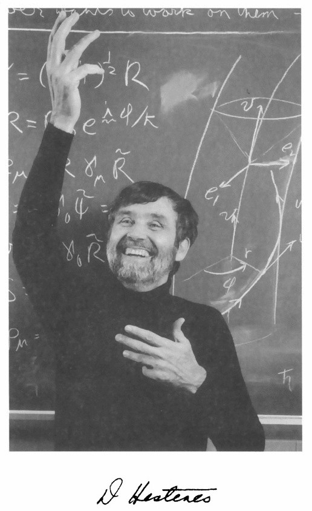

| D. Hestenes | William Kindom Clifford |
|:-:|:-:|
| ||

This document describes the implementation, installation and use of a geometric algebra module written in python that utilizes the *sympy* symbolic algebra library. The python module ga has been developed for coordinate free calculations using the operations (geometric, outer, and inner products etc.) of geometric algebra. The operations can be defined using a completely arbitrary metric defined by the inner products of a set of arbitrary vectors or the metric can be restricted to enforce orthogonality and signature constraints on the set of vectors. Additionally, a metric that is a function of a coordinate set can be defined so that a geometric algebra over a manifold can be implemented. Geometric algebras over submanifolds of the base manifold are also supported as well as linear multivector differential operators and linear transformations. In addition the module includes the geometric, outer (curl) and inner (div) derivatives. The module requires the *sympy* module and the numpy module for numerical linear algebra calculations. For LaTeX output a LaTeX distribution and pdf viewer must be installed. If the user is interested in using geometric algebra for strictly numerical purposes I would recommend using the *glucat* C++ templates which have a python wrapper for python users (<http://glucat.sourceforge.net/>).